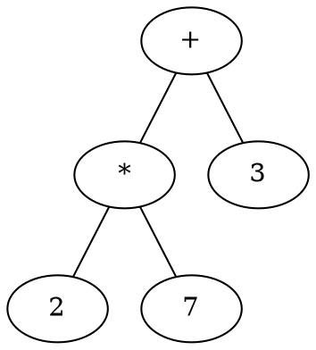

# Dyad Compiler Passes

This document discusses how the Dyad compiler processes information. It is
important to keep in mind that the Dyad compiler is developed primarily for
interactive use cases (VS Code language server, Dyad GUI). This means that
it is constantly reacting to changes in the Dyad code and tried to leverage
caching in order to make these reactions as quick as possible.

Note that the term compiler "pass" implies that these are done sequentially, one
after the other. The reality is that the interactive nature of the Dyad
compiler is that each pass depends on previous passes (so in that sense they are
sequential) but any given change to the source code will trigger these passes to
be run again. Ideally, we cache significant amounts of information from
previous passes so that we don't need to recompute them because changes to the
source code happen frequently in our development tools.

## Package Structure

### Dyad Component Libraries

When a Dyad library is first created, the directory structure, `Project.toml`
file and _initial_ contents of the `src` directory are all initialized during
library creation.

### Source Code

Dyad source code lives in the `dyad` directory of a Julia package. Furthermore,
additional _static_ files may also be found in the `assets` folder. This is
important because **these are the only two places** the Dyad compiler ever looks
for files. It is **by design** that the compiler limits it's I/O to these
directories. In fact, from within the Dyad compiler framework, it is only
possible to express I/O operations on these two locations.

### Generated Code

Code generated by the Dyad compiler is placed in the `generated` directory
inside the Julia package. It is important that no _other_ code ever be stored
in the `generated` folder because it will be removed during the compilation
process. Also note that all files in the `generated` directory contain
preambles indicating that these files are automatically generated and should
never be edited (because they will be overwritten).

## Abstract Syntax Tree (AST)

Now that we've covered where the source files are located, we can discuss how
the abstract syntax tree is created. Dyad is designed for "round tripping"
between the AST and the source files. What this means is that we can always
(and losslessly) convert a source file into an AST **and** we can convert an AST
into a source file. This property is necessary because there are two means by
which a Dyad component library can be "edited". One is to edit the Dyad source
code but the other is to edit the library "programmatically" (_e.g._ dragging
and dropping components around on a diagram). In the former case, we convert
source code into AST but in the latter case, we convert the (mutated) AST back
into source code. Ultimately, the textual source code is the "single source of
truth" in this system but programmatic editing basically involves reading the
source code into an AST, modifying the AST and then writing the source code back
out again.

We use the [`chevrotain`](https://www.npmjs.com/package/chevrotain) library to
parse our source code and generate a concrete syntax tree and then we build an
AST using the [`immer`](https://www.npmjs.com/package/immer) library to
synthesize make the AST immutable. By making the AST immutable, we can use the
objects identity as a proxy for equality. But as we will see
[shortly](#storing-annotations-in-javascript), this has an additional benefit
when annotating the tree.

## Annotated Tree

Once we have the abstract syntax tree, there are several passes performed to
"annotate" the AST. This is based on the notion of an [attribute
grammar](https://en.wikipedia.org/wiki/Attribute_grammar).

We call this the annotated tree because it includes additional attributes. The
important thing to understand is that these attributes are stored **outside**
the tree itself (hence "annotated").

### Inherited Attributes

#### `parent`

An inherited attribute is an attribute that can be computed _exclusively_ using
information from it and its parent node(s). The simplest and best example is
**the parent node itself**. In other words, the `parent` attribute of a node is
an inherited attribute that simply returns...the parent node. We cannot really
build a tree bottom up that includes both child and parent information in the
tree itself. But we can "compute" an inherited attribute called `parent` after
building the tree.

#### `path`

Another useful inherited attribute is `path` which gives you a path (see [lodash
documentation](https://en.wikipedia.org/wiki/Attribute_grammar) to understand
what this path is and how you might use it). The path is inherited because it
depends exclusively on information from the parent.

### Synthetic Attributes

A synthetic attribute is an attribute that can be computed _exclusively_ using
information from it and its children. Think of tree representation of an expression,
_e.g.,_



Imagine we want to associate an attribute with each node in this tree that
represented its value. Obviously, all the literal nodes, `2`, `3` and `7`, have
the the values $2$, $3$ and $7$, respectively. But what about the `*` node?
Well its value is based on itself (the fact that it is multiplication) and its
children. So its value is $14$. Finally, the `+` node's value is $17$.

These synthetic attributes do not appear in the tree, but we can nevertheless
associate them with nodes in the tree.

#### `hashes`

There are two fields in the object associated with the `hashes` attribute,
`contentHash` and `semanticHash`.

The `contentHash` synthetic attribute is a hash of the complete AST for a given
definition or a "hash of hashes" for a module (ala a [Merkel
Tree](https://en.wikipedia.org/wiki/Merkle_tree)). This hashes the entire
content of the AST node including non-semantic information like metadata and
documentation strings.

This is like the `contentHash` attribute although it includes only semantically
relevant information (_i.e.,_ unlike the `contentHash`, it excludes metadata and documentation strings).

### Storing Annotations in Javascript

Each time we parse a file, we graft the particular AST for that file into our
overall workspace AST. As mentioned previously, we use `immer` for this and it
takes care of rebuilding only the parts of the AST that must change while
re-using as much of the AST as possible.

A result of using `immer` is that the "address" of particular nodes (_i.e.,_
their [object
identity](https://giacomocerquone.com/blog/whats-an-object-identity-in-javascript/))
doesn't change if the contents of that tree don't change. This is a perfect
application for a `WeakMap` in Javascript. So if we want to annotate our tree
with an attribute of type `T`, we can create a `WeakMap<ASTNode, T>` that maps
one of our nodes **identities** into a value of type `T`. The great thing about
the "weakness" of the map is that if the underlying `ASTNode` is garbage
collected away, so is that entry in the `WeakMap`. Or, said another way, the
fact that the `WeakMap` references our `ASTNode` doesn't count as a "reference"
to that node and, therefore, doesn't prevent the node from being garbage
collected away.

The underlying value of all this is that we don't need to worry
about memory management. We can just happily go around adding entries to such a
`WeakMap` and the Javascript runtime will cheerfully take care of all the
garbage collection for us so that we don't need to worry about leaking memory.
As such, using `WeakMap`s is the perfect way to annotate our data structures.

## Complex Attributes

### Introduction

Inherited and synthetic attributes only get us so far. Eventually, we are faced
with complex computations that don't fit neatly into this mold. A good example
is the creation of symbol tables.

In Dyad, the scoping rules work as follows. If a type name is referenced within
a given scope, we look for that type in the following locations and in this
order:

1. Is it the name of a Dyad builtin type? (_e.g.,_ `Real`)
2. Is it the name of a _sibling_ definition in the same module?
3. Is it the name of a symbol imported by the containing file?
4. Is it the name of a top-level library?
5. Is it the name of a definition inside the "base" `Dyad` library?

The first "yes" in this sequence determines which symbol is used. Obviously,
there are opportunities for shadowing here (_e.g.,_ a sibling definition may
have the same name as a definition in `Dyad`).

But the key point in all of this is that the symbols available in a given scope
are neither inherited nor synthetic. So how do we deal with these?

### Coarser Dependencies

The key thing about both inherited attributes and synthetic attributes is that
the dependencies for a given attribute _mirror_ the graph itself. This is very
convenient. But, as we've already explained, it isn't always the case.

The challenge here is to have a relatively simple and robust way to describe
dependencies so that we can easily determine when to invalidate any cached
values.

One thing to recognize as we start contemplating these more complex attributes
is how they related to each other. Consider the following Dyad code:

```
partial component Foo
  variable x::Real
end

component FirstOrder
  extends Foo
relations
  der(x) = -x
end
```

We can see that `FirstOrder` contains a variable of type `Real`. But in order
to know that, we need to resolve the type `Foo` and then expand the contents of
`Foo` into `FirstOrder`. So there is a transitive dependence of `FirstOrder` on
`Real` through `Foo`. What this means is that if `Foo` changes, so do the
contents of `FirstOrder`. For example, imagine if we changed `Foo` to:

```
partial component Foo
  variable x::Real[3]
end
```

Now `FirstOrder` would still be semantically valid, but the type of `x` in
`FirstOrder` will have changed **even though we didn't make any changed to the
definition of `FirstOrder`**. This is why the "type" of `FirstOrder` cannot be
a synthetic attribute...it isn't determined strictly based on the AST of
`FirstOrder`.

We can restate this as saying that `FirstOrder` depends on `Foo` which, in turn,
depends on `Real`. Or, more succinctly, `FirstOrder -> Foo -> Real`. But the
key thing to notice here is that we are not speaking at all about abstract
syntax tree nodes, but rather about **definitions** in Dyad. So instead of
worrying about every single node in the AST and what might depend on it, we can
actually _aggregate_ our concerns together and simply think in terms of these
coarser entities.

The main "entity" we concern ourselves with is definitions. However, it is
worth noting that we also have modules and files to contend with as well. But
the conclusion is the same...we are no longer talking about dependencies between
AST nodes, but rather dependencies between these other entities. It is also
worth nothing that we can easily refer to all these entities **by name**.

### Entities

The distinguish these coarser elements from individual AST nodes, we will call
the coarser elements _entities_. The following entities are present in Dyad:

- Library entity (instance of `DyadLibrary`)
- Module entity (instance of `DyadModule`)
- File entity (instance of `RawFile` or `ParsedFile`)
- Definition entity (instance of a `Definition` node)

### Types of Complex Attributes

So what are the complex attributes that we would associate with these entities?

Individual entities can have the following attributes associated with them:

- `symbols`: Individual symbols associated with that entity (and only that
  entity, not its children). These symbols can then be easily mapped to fully
  qualified `NamedType` instances as well.
- `flattened`: Resolves all types (and only those types) that are needed to
  resolve a definition to a "flat" (no inheritance) definition. **NB**: This
  means that types of subcomponents, variables, _etc_. are **not** resolved (at
  least not in _this_ step).
- `type`: Resolved type (associated only with definition entities)
- `base`: Default values for any given type, if any (associated only with definition entities)

### Complex Resolutions

Specific complex attributes can depend on other complex attributes. These are
expressed using `rxjs` Observables and, specifically, fairly complex `pipe`
operations that generally involve "higher order observables" (along with
operators like `switchAll`).

In this section, we document some of the more complex resolution schemes to
demonstrate the dependence of complex attributes on each other:
