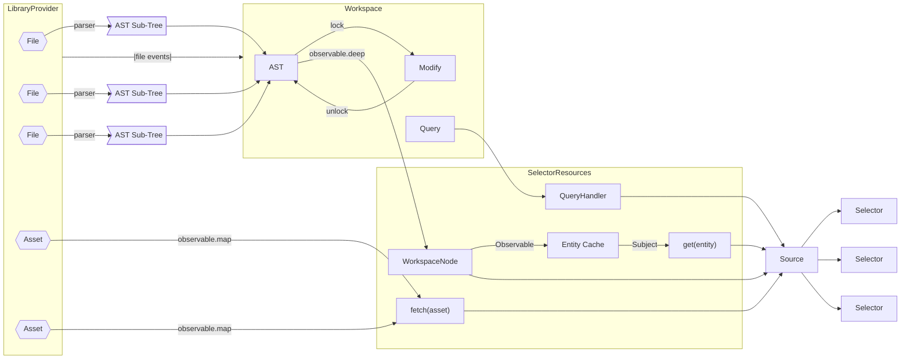

# Semantic Analysis

In our move to make the `Workspace` API completely reactive, I've been thinking
a lot about the architecture. An overview of the reactive architecture I want
to implement for `dyad-kernel` is shown [here](#architecture). The following
sections will discuss how the various pieces in this architecture function and
how this connects into [the specific semantic processing steps we need to perform](#use-cases).

## Files

All source files exist in some kind of `LibraryProvider`. The `LibraryProvider`
has a very limited "file system like" API. These limitations are intentional
because I want to interact with the file system to be limited to just a few
operations.

When a `LibraryProvider` is initially registered, the files in it are made
"visible" to the `Workspace` (the addition, modification or deletion of files is
communicated by file events which are sent from each `LibraryProvider` to the
`Workspace`).

The files are ultimately **the single source of truth** of the AST. How this
works in the context of programmatic mutation is discussed [here](#mutation).

## AST

The overall AST is managed by the `Workspace.  It's root is a single
`WorkspaceNode`and the sub-trees for each distinct library are children of this
root node. For all new or changed files, the`Workspace` parses the files and
grafts its sub-tree into the overall workspace AST.

As of `v0.20.0`, the AST is **mutable**. This is a big change compared to
our previous, `immer` based approach. The new mutable approach leverages `mobx`
to track information about dependencies _implicitly_.

## Mutation

As mentioned previously, information flows from the files into AST sub-trees
which are then grafted into the overall AST. So how can we perform programmatic
mutations on the AST?

A key property of Dyad is that you can **unparse** any particular AST tree back
into source code **losslessly**. This strongly influences the grammar of Dyad
and it is why we specifically avoid (for now) things like free-form comments.
The key point here is that everything in the file must be represented in the AST
in order for us to round trip from file to AST back to file. If something from
the file was missing, it couldn't be reconstituted via this "unparsing" process.

So how do we reconcile these potential programmatic manipulations with the files
being the single source of truth. The answer is that any time we
programmatically manipulating the AST we don't (only) update the AST, we update
the files they arose from.

There is still a potential race condition here which could arise if there were
simultaneously a modification to the file **and** a programmatic mutation of
that files sub-tree at the same time. The "winner" would be resolved based on
whether the `Workspace` saw the file update before the mutation and subsequent
rewriting of the unparsed sub-tree. In theory, this could still be avoided by
always reparsing the underlying file and applying just a diff back to the file.
But since we aren't dealing with
[CRDTs](https://en.wikipedia.org/wiki/Conflict-free_replicated_data_type), we
cannot completely eliminate such race conditions.

In order to manage simultaneous access to the AST, all modifications are
expected to be performed calls to `Workspace.modify`. Unfortunately when using
`mobx`, we don't have any way of actually preventing (or even detecting) if a
modification occurred outside of `Workspace.modify`, so it some "discipline" is
required here.

The `modify` methods are all meant for synchronous modifications to the AST.
Performing modifications synchronously minimizes any chance of a conflict. If
you absolutely must perform an asynchronous modification, you can use the
`transaction` method to create a transaction which can accept multiple,
asynchronous mutations.

Note that while each mutation performed via `modify` is synchronous, you'll
notice that the methods themselves **are not**. This may seem strange but the
reality is that while the actual modification is synchronous (_i.e.,_ it does
not yield control while performing the modification and, therefore, the tree
cannot change while the modification is being performed), there are two
asynchronous aspects to the `modify` lifecycle. The first is that the AST may be
locked for modification because _another_ modification is being performed or
because some (potentially asynchronous) read process is going on (like code
generation). The `Workspace` includes a mutex to ensure that all modifications
are mutually exclusive. So while the `modify` method performs the modification
synchronously, it may be necessary for it to **wait** for the AST to be
unlocked. Another asynchronous aspect of this is that even though the AST has
been modified, the upstream files (shown on the [architecture
diagram](#architecture) and discussed [here](#files)) are written
_asynchronously_. So the method returns a `Promise` that is resolved only once
the upstream files have actually been written.

## Reactivity Refactored

Our initial implementation with `immer` had some issues with being truly
reactive (its flaws are detailed [here](#appendix-a-what-i-got-wrong)). We had
not good way of tracking dependency information. Attempts were made to create
an `rxjs` based approach to semantic processing that could be made completely
reactive. But the need to create explicit chains of higher order `Observable`s
made the code hard to read.

In contrast, switching from `immer` to `mobx` allowed us to write "plain old
TypeScript" which made the code far more readable. In this case, `mobx` tracked
dependencies implicitly but still gave us the fully reactive capability and
opportunities to cache information that hasn't changed.

## Speculative

As an aside, one thing about compiler passes and semantic processing is that it
as to be robust to errors. This means that any computations that are performed
are somewhat "speculative", _i.e.,_ we cannot be sure they will work. This is
why the `Result` type from `dyad-common` exists and why I recently rewrote it to
have a 100% chainable API. This turns out to be very important for making the
code more readable and it means it blends with the (also chainable) `rxjs`
primitives much better.

The most essential thing to understand about `Result` is that we have three
possible outcomes from a given "operation" in the compiler. Assuming we are
trying to compute something of type `T`, we have these three possibilities:

- Everything worked, no problems (this is a `SuccessfulResult<T>`)
- We got a value (of type `T`), but there were problems (this is a
  `PartialResult<T>`)
- Finally, there is the possibility that there were one or more problems such
  that no value of type `T` could result from our calculations (this is a
  `FailedResult<T>`)

Like other monadic types (_e.g.,_ `Maybe`, `Either`, `Future`, `Promise`), the
`Result` type provides methods like `map`, `chain`, `all` and `combine` to chain
together sequences of speculative computations in easy to read code.

## Entities

An early mistake was passing around actual `ASTNode`s when doing semantic
processing. This create situations where "stale" nodes were being held on to
and lead to erroneous results. So another improvement in the architecture has
been the replacement of these `ASTNode` instances with `Entity` values.
Conceptually, an `Entity` is a "pointer" to an `ASTNode`. Having an `Entity` in
hand, one can always request the _current_ `ASTNode` associated with that
`Entity`.

## Multiple Streams of Information, Always Available

Another key insight is that although most of our processing is based on one or
more sub-trees of the AST, there are a few other sources of information we need
to "react" to. One of these is changes in the assets (since our Dyad code can
include references to assets). For example, assets are used in rendering what a
Dyad components look like. Also, our Dyad analyses will soon be based on JSON
Schemas stored as assets. Because the information in these assets is
potentially semantic in nature, our processing pipelines not only need access to
it, they need to _react_ to changes in it (because it changes the result of the
pipeline).

But it isn't just the AST and assets that are sources of information for our
processing. There are several "high-level" pieces of information that processing
can rely on. For example, looking up an `ASTNode` by its name or resolving the
type of a given symbol in a given context. Now while it is true that all of this
information is, ultimately, also sourced from the AST it is so common that we
don't want it constantly recomputed in the processing pipeline. Furthermore, it
is also so common that we ideally want to _cache_ this information so that
previously computed results are immediately available to consumers. So for this
reason we include among the upstream sources of information a series of
"attributes" that are commonly needed in semantic processing. For example, the
mapping between `Entity` values and `ASTNode`s is an attribute (so are the
relationships between `Entity` values).

Another common, practical issue when writing semantic processing in a reactive
way is that we constant need to "go back to the well". By this I mean that while
we might start by plucking some information from the AST and then process it to
produce a result, the _next_ step in the processing requires us to go _back_ and
reference even more streams of information. And this happens over and over again
(sometimes _recursively_). An example of this is shown [here](#an-example).

So, our design needs to make it as easy as possible to pull in new sources
of information. How this is done will be discussed in the next section.

## Pattern Based

Ultimately, our reactive approach is built entirely on top of `mobx`. However,
as mentioned previously, `mobx` allows us to write "plain old TypeScript". But
when writing code there are several patterns that emerge, these are:

1. The need to re-traverse the AST from the root
2. The need to leverage pre-computed attributes
3. The need to reference assets
4. The need to _compose_ previous computations
5. The need to propagate problems consistently

For this reason, we've implemented the `Selector` type which is defined as
follows:

```typescript
export type Selector<T> = (res: SelectorResources) => T;
```

...where `SelectorResources` is defined as:

```typescript
export interface SelectorResources {
  root: WorkspaceNode;
  attrs: Attributes;
  query: QueryHandler;
  fetch: FetchHandler;
}
```

Furthermore, `QueryHandler` and `FetchHandler` are defined as:

```typescript
export type QueryHandler = <T>(s: Selector<T>) => T;
export type FetchHandler = (url: string) => Result<FetchResponse>;
```

So let's walk through our previous list and see how these help us:

1. `SelectorResources` provides any `Selector` with access to the `root` node.
2. `SelectorResources` provides any `Selector` with access to `Attributes` via
   the `attrs` field.
3. `SelectorResources` provides the `fetch` handler which allows the `Selector`
   to _synchronously_ request assets (how this is done is discussed below)
4. The `query` field in `SelectorResources` allows a `Selector` to make queries
   to _other `Selector`s_. This allows `Selector` computations to be composed
   (even recursively).
5. Propagation of problems is handled nicely if the `Selector` returns an
   instance of `Result` (discussed previously).

## Assets

Within Dyad it is possible to refer to assets (images, JSON schemas, _etc._)
using URIs. Furthermore, Dyad provides a `dyad://` scheme for references
_package local_ assets.

But, as discussed previously, the `Selector` system allows such assets to
accessed _synchronously_. This raises two questions...How? and Why?

Let's start with why. Writing reactive code is challenging enough without the
additional complexities of asynchronous calculations. So having a method that
can be invoked that returns _immediately_ the asset required allows code to be
written in a completely synchronous way. Now with modern `async`/`await`
languages the complexities of asynchronous code aren't too bad. But there is
another reason to do this and that is performance. If we cache these assets
then we don't need to integrate the waits associated with asynchronous access
into our processing. All that sounds great...but _how_ can be do this?

There are two aspects to the "How?" question. The first is...how can these
assets already be available to us? This works because when we parse a Dyad file
we can find all references to URIs contained in the model and fetch them at the
same time we parse the file. In this way, all the assets are (generally)
available once the Dyad code is added to the AST. This is how a `Selector` can
be reasonably sure that the information will be there when it invokes the
`fetch` function associated with the `SelectorResources` structure.

Now there is another aspect to "How"? What happens if the asset wasn't
available during parsing or it changes at some point. Won't that mess up our
processing. The answer is...no. This is because the assets are cached in an
`observable.map` (from `mobx`) which means that any change to the asset will
immediate trigger a "recalculation" of anything that was derived from that
asset. This means that even if the asset isn't found when the `Selector` is
run, a `FailedResult` will initially be returned but it will (ideally) be
quickly replaced by a `SuccessfulResult` and the processing will be re-triggered
with the asset in hand.

## An Example

## Use Cases

So Dyad Studio or Dyad GUI might design their own `Selector`s to extract
information that they need. But it turns out that there many `Selector`s
required by the compiler that can be leveraged. Remember, `Selector`s compose
quite nicely due to their chaining API so you can build off of existing
`Selector`s. In this section we'll walk through the kinds of `Selector`s the
compiler needs to make use of and what kinds of information they provide.

### Semantic Checks

One use case for `Pipeline`s is to pull together all the information for a
single definition. The idea here is to focus that specific definition and not
report issues outside that definition. Imagine, for example, that you are
working with a definition in Dyad Studio and you have a given file open.
You expect to see issues associated with _that file_. Imagine a case where a
declaration like this appeared:

```
  a = Resistor(R=100)
```

...and this bit of code was underlined with a message saying:

```
unable to resolve type "Current"
```

But there is no mention of `Current` in this code. Imagine this message arises
because of an error inside the `Resistor` definition? This would be pretty
confusing. So we don't to surface issues _inside_ the `Resistor` definition
**here**. We only want to see issues that are _actionable_ in the context of a
definition.

Included in this principle of only checking things that are actionable within
the class would be issues inside `extend`ed definitions. What this means, in
practice, is that _some_ issues should be reported and others shouldn't. Again,
the distinction is whether the corrective action would take place in _this_
definition or in the definition of the component being extended. Here is a
concrete example:

```
partial component Base
  p = Pin2()
  parameter x::Temperature
end

component Complete
  extends Base(R=100)
  end
```

Let's assume `Pin2` is not defined. That issue should be flagged only for the
`Base` definition. On the other hand, the fact that `Base` lacks any variable
named `R` to modify is an issue in `Complete`.

### Definition Editing

Another use case is editing of a component in the GUI. Here we have a slightly
different rule compared [semantic checks](#semantic-checks). The reason is that
in order to properly edit a definition, the definition must be flattened. For
example, if you are editing the `Resistor` component and that extends `TwoPin`
which provides to pins, `p` and `n`. If you are editing the `Resistor`, you
expect to see `p` and `n` in the diagram...even though those are not actually
"in" the definition of `Resistor`. So in the case of definition editing, it is
necessary to dig a bit "deeper" than for semantic checks and to fully flatten
the definition (at least flatten the _interface_ portions of the definitions
being `extend`ed).

### Compilation

For compilation, the elaboration we perform will depend somewhat on the backend.
For ModelingToolkit, we completely flatten the definition. This means no code
is generated for a `partial` component. Furthermore, if a non-`partial`
component extends from a non-`partial` component then no code is reused between
the two.

However, for the DAECompiler backend, the tentative plan is to preserve this
structure because of potential optimizations that the DAECompiler might perform.
So in this case we may choose to not flatten the definition. In the case of
ModelingToolkit, we going to perform an elaboration more like the elaboration
required for [definition editing](#definition-editing) while in the case of
DAECompiler we will probably perform the elaborations associated with [semantic
checking](#semantic-checks).

### Conclusions

A key aspect of these `Selector`s is where they terminate. In some cases, they
may flatten the `extend` statements but in other cases they may not. So ideally
we want to design `Selector`s such that they can be easily extended in ways that
are useful for the various use cases.

Besides an `extend`s clause, some processing may require us to elaborate/flatten
components are even variable or structure declarations. Again, the `Selector`s
will ideally be designed so that the processing can easily be extended when
needed but otherwise reuse much of the elaboration used for other cases.

## Architecture



# Appendix A: What I Got Wrong

## How it started

The original approach to reactivity in the `Workspace` was to implement two
methods on the `Workspace` called `query` and `follow`. These took, as their
principal argument, a `Selector<T>`. The idea was that, given a `Selector<T>`,
the `follow` method would return an `Observable<T>` (whereas `query` just
returns the "latest" `T`).

The problem was that a `Selector<T>` was defined as:

```typescript
type Selector<T> = (root: WorkspaceNode) => T;
```

In other words, it was a function that, when applied to a `WorkspaceNode` (the
root node in the AST) would return a `T`. And this works ok for simple cases
where you just want to perform a simple transform on the AST (_e.g.,_ pluck out
some information about a particular node or subtree)

## How it is going

The **problem** is that if you aren't interested in a particular node or
sub-tree, then you have to simultaneously keep your eyes on multiple nodes and
sub-trees. Even worse is if one node or sub-tree determines what _other_ nodes
and sub-trees you need to also monitor. This gets complicated when a change to
that original node or sub-tree can change which _other_ nodes or sub-trees you
want to monitor.

Now, if you "sub-tree" is the entire AST tree, then the original approach kinda
works. But then you end up "reacting" to any change, any where in the tree,
whether it impacts you or not. So that is less than optimal.

The fundamental limitation with this approach is that it doesn't given any
downstream (from the `Selector<T>`) any means to reach back upstream and
subscribe at the original source. This makes building pipelines quite awkward.
The "solution" is that you have to pass around an instance of `workspace`
everywhere (in fact you often need to close over a lot of different information
in general) and this argument passing style is quite the opposite of the normal
chainable or operator based approach to reactive programming (where all the
necessary values are contained in the pipeline).

Another that that absolutely did not help was the fact that some streams of
information involved nested `Maybe`s, others involved nested `Either`s while
most involved nested `Result`s. The fact that the `Result` API wasn't (yet)
fully chainable **also** made this super awkward to work with.
