# Domain Model

## High Level Concepts

To truly understand the workflows, user interface and user experience associated
with a system simulation tool, it is important to understand the underlying
domain. This document discusses the various "things" that are involved and how
they are related to each other.

### Application and Workspace

Let's start from the top. Specifically, let's start with the GUI application
itself. The purpose of the application is to allow the user to work on a
_Project_. But before we can talk about the _Project_, we need to introduce the
concept of the _Workspace_. Each _Application_ contains exactly one
_Workspace_:

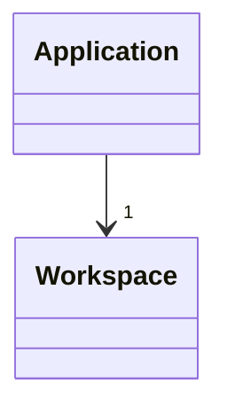

### Project

The purpose of the _Workspace_ is simply to be the center of all work being
done. As mentioned before, the goal of the _Workspace_ is to work on a
_Project_:

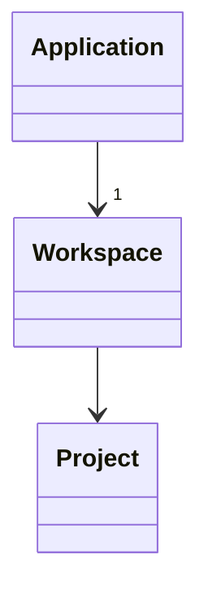

So far this looks simple, but it is going to get more complex as we work through
the rest of the concepts involved.

### Dependencies

It turns out that this _Project_ is a library of components. Furthermore, the
_Project_ also has _Dependencies_. These are _also_ libraries of components.
The best way to understand this is that the _Project_ is what the user is
currently working on and the _Dependencies_ are the things that are already
done. These concepts are related as follows:

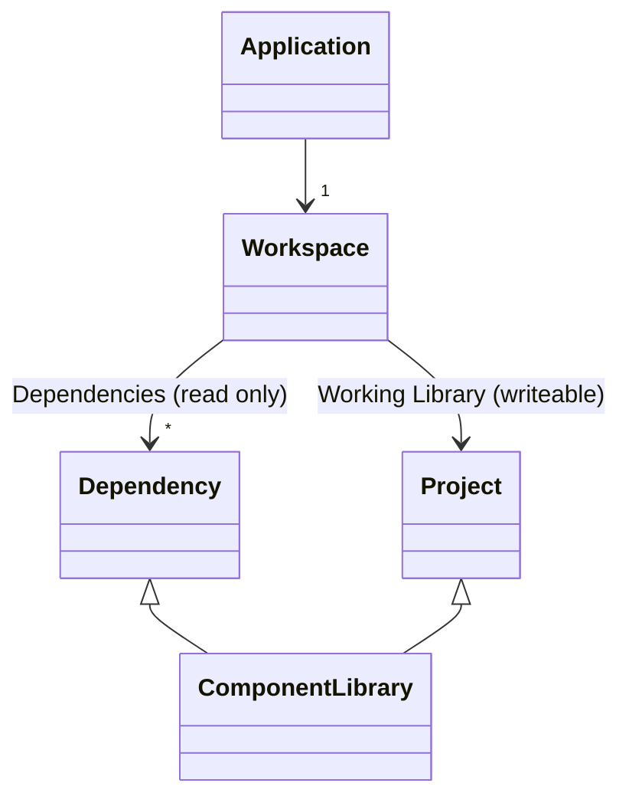

Now, technically it is possible for a user to be working on more than one
project at a time. So let's just make this explicit in the cardinality:


## Component Libraries

Let's leave the _Application_, _Workspace_, _Project_ and _Dependencies_ behind
at this point. We've said most of what needs to be said there. Now let's focus
on the component libraries and what those are composed of because they are where
complexity really comes in.

As already mentioned, a given _Workspace_ will be composed of multiple _Component
Libraries_. One or more of these _Component Libraries_ will be under _active
development_ (the _Projects_) while others contain pre-built _Components_ that
we may wish to use in our project.

Just to add a concrete visual here, this is an example of what one might see if
they were to open up a _Component Library_:


### Modules

For typical engineering workflows there are a large number of potential
components that might be needed in order to construct a system. As such, each
_Component Library_ may, itself, be organized into one or more _Modules_.

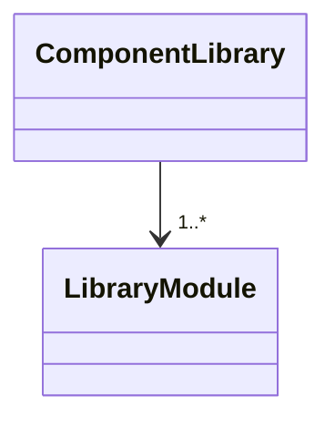

### Components

The primary work involved in any _Project_ is to create new _Components_. When
you define a new _Component_ you typically create a new _Component_ and then
"open" that _Component_ to edit it. Then you drag _other_ _Components_ into the
graphical editor for the _Component_ you are defining.

In most tools, the set of existing _Components_ will be rendered somehow on the
left side and the canvas where you are constructing/defining the new _Component_
will be in the center and you will drag _Components_ from the left side onto the
canvas:


You can also see, in the figure above, that the _Components_ or organized into
_Modules_ (e.g., "Forces", "Parts", "Joints").

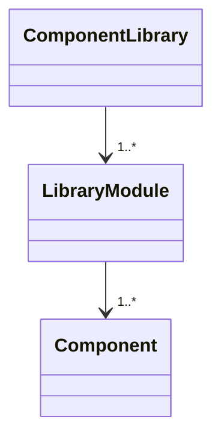

### Connectors

While it is called a _Component Library_ it turns out that most, but not all,
things in the _Component Library_ are _Components_. It turns out there are
other things in there as well. One of the additional things you will find in a
_Component Library_ is a _Connector_. So strictly speaking, a _Module_ is
actually composed of _Definitions_ and some of these define _Components_ and
others define _Connectors_:

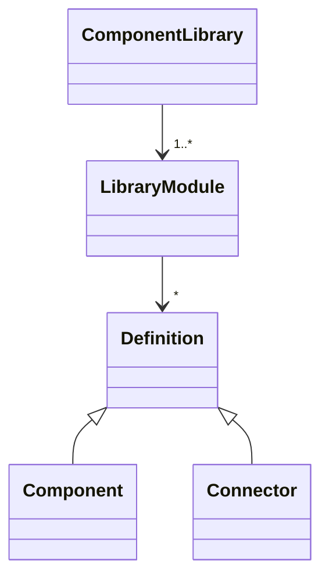

Furthermore, the _Components_ and _Connectors_ are actually related to _each other_:

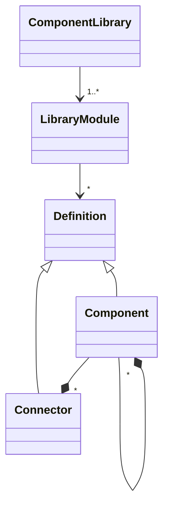

The thing to note in this last diagram is that each _Component_ has _Connectors_
associated with it along with _other_ potential _Components_.

### Analysis

In additional to _Components_ and _Connectors_, there is one last thing that we
can define within a _Module_ and that is an _Analysis_. So the complete picture
of a _Module_ is really:

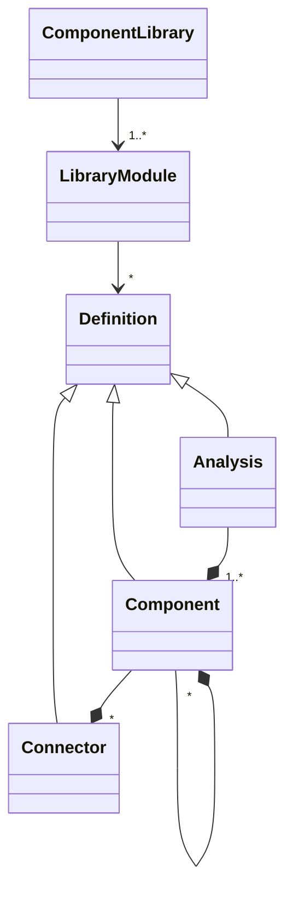

...and, as we can see, an _Analysis_ may involve one or more _Components_.
Said another way, once we have built a _Component_ we then generally use it to
perform an _Analysis_. The figure above highlights the somewhat "hierarchical"
nature of these entities. Specifically, an _Analysis_ uses _Components_ and
_Components_ are composed of _other_ _Components_ as well as a _Connectors_.

It turns out there are multiple types of _Analyses_ in our system as well:

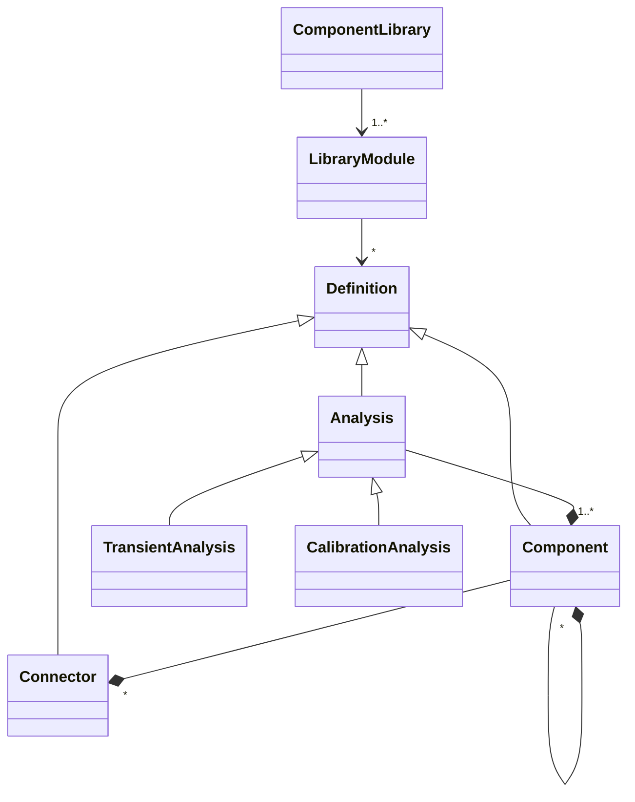

## Views

That last thing we need to talk about is "views". It turns out that another
"dimension" in all of this is what _aspect_ of a _Component_ we are working on
at any given time.

The best way to describe this is to draw an analogy to atoms and molecules.
This analogy isn't strictly correct but it does give you insight into why
different views are required.

Generally, _Components_ are made from other _Components_. In this case, we drag
components ([as shown previously](#components)) from a _Component Library_ into
a canvas of some kind and then we connect these _Components_ together (and these
connections between _Components_ are made between the _Connectors_ on the
_Components_, _i.e.,_ that's where the _Connectors_ come in).

Of course, it cannot be the case that every _Component_ is made of up other
_Components_ because then it would be [turtles all the way
down](https://en.wikipedia.org/wiki/Turtles_all_the_way_down). So it turns out
that _Components_ come essentially in two flavors. Some _Components_ are like
"molecules"...they are made up of other stuff (other _Components_, in fact).
But some _Components_, the "atomic" _Components_, don't contain other
_Components_. Instead, they contain a textual description of behavior in the
form of _Variables_ and _Relations_.

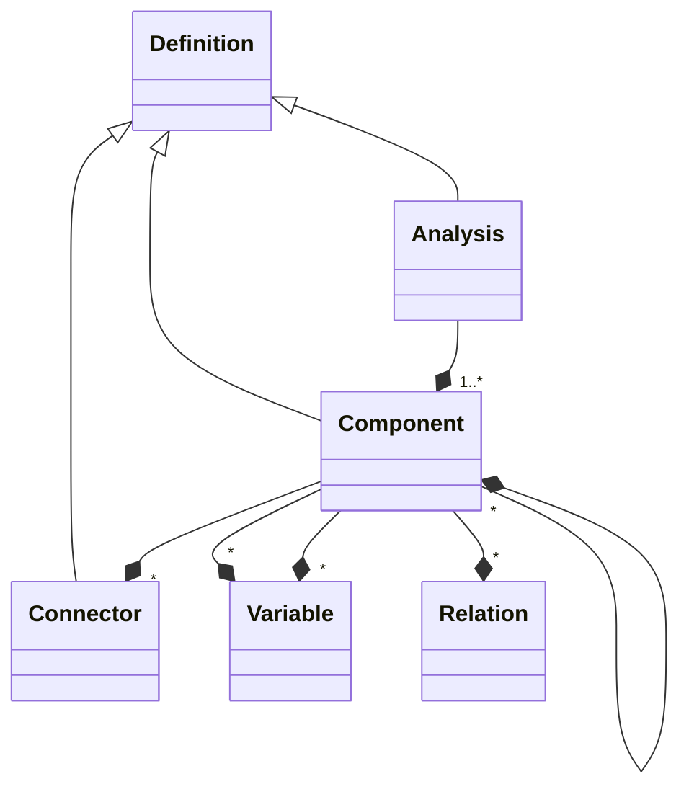

As a result, when we are working with _Components_, we need to view them from
many different "angles". Let's go into details about what those angles look
like.

### Diagram View

As mentioned previously, when building these "molecule" _Components_, we use a
canvas. This is often referred to as the "diagram view" because we interact with
the _Component_ in a graphical way and we view it as being composed of
_Components_ and _Connectors_ dragged into the canvas from a _Component Library_
and then connected together. Information about the location of the _Components_
and the routing of the connections between _Connectors_ is presented to the user
_graphically_ in this view.

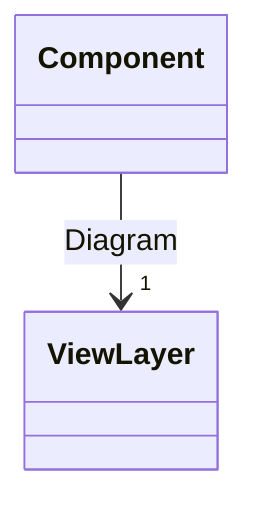

### Behavior View

For those "atomic" _Components_, we need a way to describe their fundamental
behavior not in terms of other _Components_ but in terms of _Variables_ and
_Relations_. This is typically presented as a textual layer. These models are
all fundamentally represented by text files and these text files \*\*contain all
information about every aspect of the _Component_. However, when viewing just
the behaviors we often want to filter out any "graphical" information. So this
view presents only a subset of the complete textual representation.

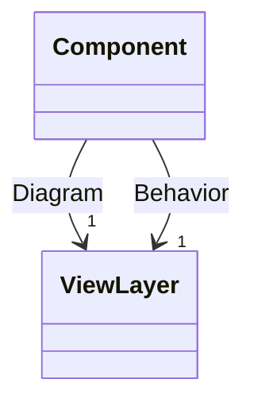

It turns out that connectors are generally "atomic". So they are usually viewed
with a textual representation. But since they _only_ have _Variables_ inside of
them, it isn't quite accurate to call this a view of behavior but more just in
terms of variables.

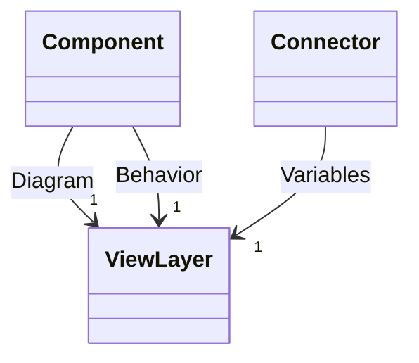

### Icon View

Think of these "molecule" _Components_ as if they were an electronic device like
a computer. On the _inside_, they are composed of all kinds of other
_Components_ (CPU, wires, resistors). But you don't see that when you look at
the computer from the _outside_. _Components_ are the same. The diagram view
is what you see when you look _inside_ the _Component_ to see what it is made
of. But you also need to have to describe what it looks like from the
_outside_. This is what the Icon View is used for. In our case, we presume
that the icon is represented either by a raster image or an SVG. So there isn't
much to say about the icon view except to just say that each component should
have an icon.

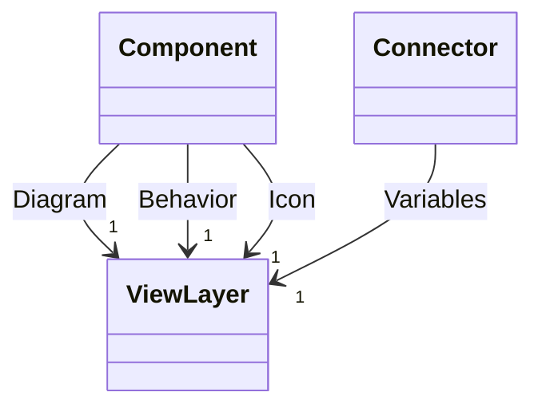

It turns out that _Connectors_ also require an icon when they are visualized so
they have an icon view as well.

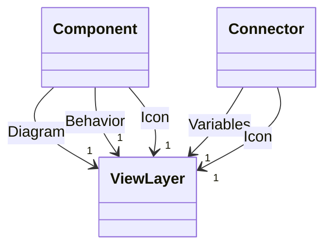

### Documentation

It turns out that not all views are for editing...some are really strictly for
viewing. An example is to use all the information available about a _Component_
to create documentation. As such, all the different _Definition_ types have a
documentation view.


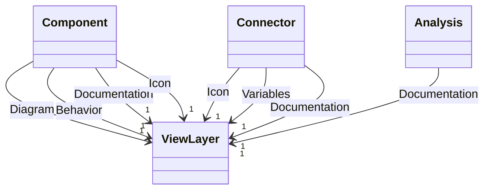

### Forms

When defining an _Analysis_ or modifying the parameters of a _Component_, we
have yet another method of interacting with these definitions which is through
forms which might look something like this:


So this adds yet another view type to deal with. It should be pointed out that
when interacting with a _Component_ through a form, we are usually using the
form to represent data associated with a specific _instance_ of that
_Component_, not the definition of the component. So imagine we are building a
_Component_ models that represents a car. That car has sub-_Comonents_ which
are things like an engine, a transmission, tires, etc. Each of the tires is a
different _instance_ and they can each have their own properties. So when we
talk about editing a _Component_ using a form, the form contains the information
about each specific instance.

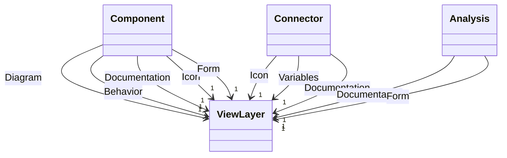

### Full Source

Lastly, we mentioned earlier that all information (textual and graphical) is
stored in the _Component_'s _Definition_ and the _Definitions_ themselves have a
textual representation. So for each of _Definition_ type it is also useful to
be able to view and edit the underlying textual representation. This is only
for "power users", but it is still necessarily functionality.

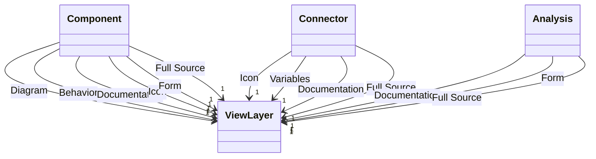

## Results

When we perform an _Analysis_, we get a _Result_. The _Result_ may, in fact, be
an error of some kind. Or, it may be a significant amount of data. Either way,
this is another type of "thing" we need to keep track of.

In the case of _Results_, these are not "defined" like the other things we've
discussed. Instead, _Results_ are _artifacts_ of our work. Furthermore, they
are the result of performing an _Analysis_ so they have some relationship with
the _Analysis_ definitions.

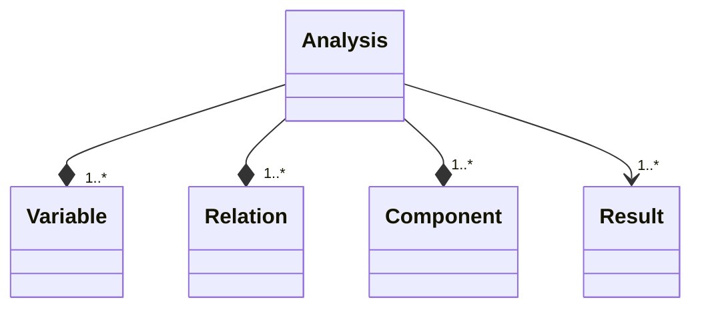

### Visuals

We view _Results_ in two fundamentally different ways. The first is by
visualizing the data contained _in_ the _Results_. Such visualizations take the
form of plots, charts, 3D animations, etc. In many cases, each _Component_ may
contain multiple "recipes" for visualizing the results involving variables
associated with that _Component_.


### Histories

The other way to view _Results_ is by their relationships to each other, time
and the underlying _Analysis_. I often refer to such visuals as "breadcrumbs"
because they help visualize the path taken when analyzing a _Component_.

```mermaid
gitGraph
   commit
   commit
   branch develop
   checkout develop
   commit
   commit
   checkout main
   commit
   commit
```

## Conclusion

When we put this all together, we get:

```mermaid
classDiagram
    class Application
    class Workspace
    class Project
    class Dependency
    class ComponentLibrary
    class LibraryModule
    class Definition
    class Component
    class Connector
    class Variable
    class Relation
    class Analysis
    class Result
    class ViewLayer
    class TransientAnalysis
    class CalibrationAnalysis

    Application --> "1" Workspace : Application has\nexactly one workspace
    Workspace --> "1..*" Project : Working Library (writeable)
    Workspace --> "*" Dependency : Dependencies (read only)
    ComponentLibrary --> "1..*" LibraryModule
    LibraryModule --> "*" Definition
    Definition <|-- Component
    Definition <|-- Connector
    Definition <|-- Analysis
    Dependency <|-- ComponentLibrary
    Project <|-- ComponentLibrary
    Component --> "1" ViewLayer : Documentation
    Component --> "1" ViewLayer : Diagram
    Component --> "1" ViewLayer : Icon
    Component --> "1" ViewLayer : Behavior
    Component --> "1" ViewLayer : Form
    Component --> "1" ViewLayer : Full Source
    Connector --> "1" ViewLayer : Variables
    Connector --> "1" ViewLayer : Icon
    Connector --> "1" ViewLayer : Documentation
    Connector --> "1" ViewLayer : Full Source
    Analysis --> "1" ViewLayer : Form
    Analysis --> "1" ViewLayer : Documentation
    Analysis --> "1" ViewLayer : Full Source
    Component --* "*" Variable
    Component --* "*" Relation
    Component --* "*" Variable
    Component --* "*" Connector
    Component --* "*" Component
    Analysis --* "1..*" Variable
    Analysis --* "1..*" Relation
    Analysis --* "1..*" Component
    Analysis --> "1..*" Result
    Analysis <|-- TransientAnalysis
    Analysis <|-- CalibrationAnalysis
```
