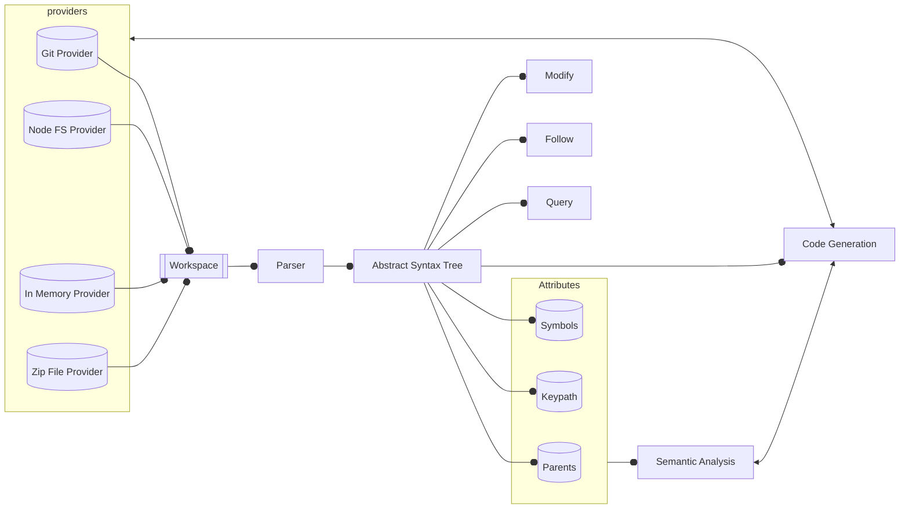

# The Dyad Workspace

## Architecture

### Overview

Let's start by getting an architectural overview of the Dyad Workspace:



### Library Providers

On the left of this diagram are the library providers. As can be seen in this diagram, there are implementations of the `LibraryProvider` interface for various storage backends (see [here](./PROVIDERS.md) for more detailed information the `LibraryProvider` interface and implementations). Conceptually, any given instance of a `LibraryProvider` represents a Julia package (both the Dyad source files as well as the generated Julia code).

### Workspace

The contents of these libraries are managed by the `Workspace` class. Any library you want to use in the `Workspace` should be an instance of the `LibraryProvider` interface and must be registered with the `Workspace` instance. Generally in any Dyad related application there will be exactly one instance of the `Workspace` class that manages all relevant libraries.

The primary job of the `Workspace` is to keep an updated version of the abstract syntax tree of the entire workspace. However, note that this tree contains subtrees associated with each of the libraries. So any update to a library means that the `Workspace` must update the subtree for that library. For more information on the structure of the abstract syntax tree, see [here](./AST.md).

### Parsing

Each `LibraryProvider` provides an observable stream of events that notify the `Workspace` of any changes in the contents of the stored files. The `Workspace` subscribes to these events and aggregates them. It then subscribes to the aggregated stream of events and tracks when any library files have been updated. Whenever an update is detected (whether it is _adding_, _changing_ or _deleting_ a file), the `Workspace` work space _grafts_ that subtree into the overall `Workspace` tree. A key point here is that it only updates parts of the tree it needs to. We'll see why in the next section.

Note that each file yields either a `ParsedFile` or `RawFile` node (for more details see [here](./AST.md)). These **are not root nodes** of our AST. Instead, the root node is a `WorkspaceNode` and it has, as its children, `DyadLibrary` nodes which then have `ParsedFile` or `RawFile` nodes as their children. So when a change to a file happens, the changed or added file is then splices into the tree. We are using `immer` to perform all these modifications to the AST which means the AST is immutable (which also means we can use object identity as a test of equality, which we will discuss shortly).

The actual parsing process is handled by the `dyad-parser` package. The implementation details of that process are not exposed by design. All we need to know is that their are two functions that this package provides. The first is `parseDyad` which takes a string (representing the contents of a file) and returns an AST (`ParsedFile` or `RawFile`) along with any lexing or parsing [problems](./PROBLEMS.md) encountered. Note, these are strictly problems associated with lexing and parsing, not _semantic_ issues. Those can only be flagged during the semantic analysis process. The other function provided is `unparseDyad` which does the reverse...it takes an AST and reconstitutes the textual representation (see [here](./PARSER.md) for more details).

The difference between a `ParsedFile` and a `RawFile` is that a `ParsedFile` was successfully parsed and we will get a full AST for the contents of that file. In the case of a `RawFile`, only the bytes of the file are preserved in the tree. This is done to ensure that nothing gets "lost" when a file has a parsing error in it. By keeping the original bytes around, it is still possible to "unparse" the file contents.

### Abstract Syntax

An important thing to understand about this architecture is that all necessarily information is captures in the abstract syntax tree (AST). The details of exactly what the structure of the AST are is [presented elsewhere](./AST.md). But it is important to understand conceptually that this is the **single source of truth** about the content of the libraries from the perspective of the application itself.

Another way to think about this is that the AST is the key piece of "application state" in the UI and that this AST is managed by the `Workspace`. Because information about the AST is critical, there are three main mechanisms that one can use to interact with the tree. These are:

- `query` - This allows you to perform a calculation based on the _current tree_.
- `follow` - This is just like query except that your query isn't just performed on the current tree but is used to construct an `Observable` so that you query yields a new result whenever new information becomes available.
- `modify` - This is the means by which you can modify contents of the AST. The way this works is just like `query` (a one time extraction of a subtree of the overall AST). But you can also pass in a function that transforms that subtree into a new subtree. This new subtree will **replace** the old subtree in the AST. This replacement, just as with the parsing, is coordinated by the `Workspace` so you don't need to know the details to use it. But behind the scenes, this is using `immer` to build a new tree and then **unparsing** that tree and writing it back to the source libraries. In this way, the AST and the upstream textual representation are _always kept in sync_.

All of these mechanisms rely on a `Selector` to be provided. A selector is defined in TypeScript as:

```typescript
export type Selector<T> = (x: WorkspaceNode) => T;
```

What this means is that it is given an AST root node, `WorkspaceNode` and it returns some value of type `T` from that. Essentially, it is transforming the complete AST into some value. Most of the time, the type `T` extends from `ASTNode`. What this means is that the `Selector` is actually used to extract some subtree from the AST. For example, I might wish to subscribe to a particular type definition in the workspace. A selector would navigate the tree to find the type I'm looking for. If I `follow` the tree with that selector, I will get updated versions as the tree is updated (if `T` does extend `ASTNode`, you should add a `distinct` operator to that subscription so you are only informed when it actually changes).

### Attributes

There are generally two types of semantic analysis. The first is the evaluation of so-called _attributes_ of the abstract syntax tree. These [attributes](https://en.wikipedia.org/wiki/Attribute_grammar) can be broken into two categories, _inherited attributes_ and _synthetic attributes_. The basic idea behind attributes is that they are pieces of information that can be computed from the abstract syntax tree. In other words, this is not information contained in the tree, but information that can be computed from the tree. More specifically, this is information that is generally associated with a particular node in the tree. In the case of _inherited attributes_, the computed value is strictly a function of the node's parents. In the case of _synthetic attributes_, the computed in terms of the node's children.

An example of a synthetic attribute might be the value of a node in an expression tree. For example, this node `(+ 7 (* 3 4))` would evaluate to $19$. This is because the node's value is the sum of the value of its children. The first child's value is simple enough to evaluate, $7$. But for the second child we need to compute the same synthetic attribute for the child, _i.e.,_ $12$. The key point here is that to compute the value of any particular node in such an expression tree, we rely solely on the values of the children.

Let's look at an example of an inherited attribute. As mentioned previously, an inherited attribute is an attribute that depends exclusively on the parent. The entire `Workspace` AST is represented internally as a JSON object. Every object in a JSON object has what is known as a ["keypath"](https://github.com/jeeeyul/underscore-keypath). This term was coined by the `underscore` library but is used by other libraries like `lodash` as well. The basic idea of a keypath is that it is a single string that refers to data nested hierarchically in a tree. So, for example, given the following JSON object:

```json
{
  "libraries": [
    { "name": "Electrical", "uuid": "ABCD-EFGH-0123-6789" },
    { "name": "Rotational", "uuid": "WYXZ-LMNO-5432-8765" }
  ]
}
```

The node corresponding to the `Electrical` library object here would have a keypath of `libraries[0]` and the uuid for that library would have a keypath of `libraries[0].uuid`. The essential point is that the keypath is a _single string_ that addresses a particular pieces of data (or subtree) within a JSON object.

Now, what does this have to do with inherited attributes? Well, a node in the AST can't know its keypath by looking at itself or its children. That information needs to be cascaded from _above_ which makes it an inherited attribute. In this way, the keypath for the entire object above is `""`. Then that root objects looks for all its children. It has only one and the path to that child is `"libraries"` so it is given that as its keypath. That object is an array so it iterates over its children and passes them their keypaths, `"libraries[0]"` and `"libraries[1]"`. In the case of `"librares[0]"`, it has two children and they are passed their keypaths of `"libraries[0].name"` and `"libraries[0].uuid"`. They key point about this key path is that it allows you to address any nested object in a JSON object uniquely.

Another example of an inherited attribute that is quite important is _parent_. When you build the abstract syntax tree, you build it from the bottom up. Each node in the tree always includes some "catalog" of its children (either in arrays or as fields in an object). So a given node trivially knows who its children are, but how can it know who its parent is? You could try and build the tree in such a way that each node has direct access to both, but this is quite tedious in practice. A much simpler way is to build the tree "bottom up" and then, when complete, make a single "top down" pass through the tree and record who the parent is.

But record it where? As it turns out, in Dyad we heavily leverage [`WeakMap`](https://developer.mozilla.org/en-US/docs/Web/JavaScript/Reference/Global_Objects/WeakMap) here. The beauty of a `WeakMap` is that it doesn't actually count as a reference to the keys in the map. This is extremely useful for caching. For example, if we want to record the keypath of a node, we create a `WeakMap<ASTNode, string>`. This maps an `ASTNode`, the node whose keypath we want to know, into a `string`, the keypath itself. But the magic of the `WeakMap` is that if, at some point later on, we get rid of the `ASTNode` (because we re-parsed a file and the old AST is no longer of interest) as long as all the references to the "old" `ASTNode` are removed, that stale `ASTNode` will get garbage collected. And since `WeakMap` **doesn't count as a reference**, it does not interfere with this process. So we can use the `WeakMap` as a cache to store these attributes without creating a memory leak. So these `WeakMap` instances allow us to effectively _augment_ the information associated with a node (storing it outside the tree, but still immediately available).

A key thing to understand about attributes is that they don't change unless the structure of the tree changes **and we know when the tree changes**. Remember that the `Workspace` is responsible for translating file splicing new abstract syntax trees into the overall workspace AST. As such, it knows exactly when and how the AST is changed and it can update these attributes when that happens. Even better, it knows _which_ nodes need updating and which ones can keep their values.

### Complex Semantic Analysis

So far, we've talked about inherited and synthetic attributes which have the nice property that they can be computed either from their parent nodes or their child nodes, respectively. But many types of semantic analysis end up being a composite of different attributes. For example, consider rendering the diagram for a given model. This depends on the children (component declarations) of that model. But it also depends on the types of those components which then have to be "found" in the overall AST. Resolving _their_ graphical appearance may then require another pass of resolving their children (connector declarations).

The results of such complex semantic queries are harder to cache. This is because the information that this analysis (_e.g._ building the diagram) depends on is not clear (unlike the attribute case where it is strictly bottom up or top down in the AST). So you could cache such information but how would you know when to invalidate the cache? These are cases where tools like `mobx` can really help. But `mobx` isn't a magic bullet and it takes some thought to design a system that can leverage it and it will become a hard dependency. So (at least for now), we aren't using `mobx`.

Because the AST is leveraging `immer`, we can use object identity (_i.e,_ memory
location) as an indicate of equality across time (since `immer` objects cannot
be mutated). So if we computed a result from a given set of `ASTNode`s and
those `ASTNode`s values haven't changed, then the previously computed result is
still valid. But keeping track of such information is quite tricky. One could
potentially leverage `rxjs` and subscribe to the various bits of information and
watch for updates. By filtering on `distinct` values in `rxjs`, we can ensure that subscriptions only send new values when one of the subscribed nodes has actually changed. But it will take some effort to ensure we properly track all possible dependencies. So, at least for the time being, these kinds of complex semantic analyses are simply performed on demand and not cached. But the more of the heavy lifting of these queries that can be pushed into the attributes, the better the performance will be.

### Code Generation

The final step in all of this is code generation. Now there are several types of code generation that the Dyad toolchain is capable of but the main one is the generation of MTK code (it can also generate JSON schema, AST and Modelica...but those are nice use cases so we won't cover them here). Given that we generate MTK (Julia) code, it is important to keep in mind that the purpose of Dyad is not (solely) to express model behavior. If that were the case, we'd just write Julia code. Dyad keeps track of lots of additional information like graphical appearance, layout and additional metadata. Furthermore, this entire architecture described above can run in the browser and doesn't require an active Julia REPL.

So instead of running in Julia, this whole system generates the Julia code.
Dyad is designed to parallel the Julia package system. A Dyad library
must also be a Julia package so must have:

- `Project.toml` (in the root directory)
- `src/` - a directory to hold generated Julia source code along with source code for any Julia functions referenced by the Dyad code.
- `test/` - a directory to hold test cases (some of which may be automatically produced by the code generation process)

But in addition to this standard structure, a Dyad component library also includes:

- `dyad/` - a directory to hold Dyad source files. These are the source files that will be the input to the code generation process
- `assets/` - a directory for holding any files referenced by the Dyad code (mostly graphical assets).

A key point is that after the code generator is run, the files in the `dyad` directory will be transformed into Julia code and written to the `src` directory. Note that code is generally generated per Dyad module (which will map to Julia modules) and use specially constructed names so it is easy to avoid cases where the code generator overwrites user created files.

Just like Julia, Dyad supports modules. All files in the `dyad` directory
are considered to be part of the same root level module. If the component author
wishes to use modules, they can simply create a subdirectory (starting with a
capital letter) and the source in their will be treated as a separate module
(both in the Dyad semantics and in the generated Julia code). So, for
example, if we had a directory called `Electrical` (where the `name` field in
`Project.toml` was also `Electrical`) and the following directory structure:

```
├── Project.toml
├── dyad
│   ├── pin.dyad
│   ├── types.dyad
│   ├── Analog
│   │   ├── resistor.dyad
│   │   ├── capacitor.dyad
│   │   ├── inductor.dyad
│   │   ├── ground.dyad
├── assets
```

...we would end up with a Julia package called `Electrical` that contained whatever definitions were in `dyad/pin.dyad` and `dyad/types.dyad` (since they are at the root of the `dyad` directory) **and** a module called `Electrical.Analog` which would contain whatever definitions where present in `src/Analog/resistor.dyad`, `src/Analog/capacitor.dyad`, `src/Analog/inductor.dyad` and `src/Analog/ground.dyad`.

The code generators each function differently but the code generator for MTK code is event driven. Anyone invoking the code generator must provide an implementation of `MTKHandler` which is defined as follows:

```typescript
export type ModuleName = string[];

export type SourceKind = "components" | "tests" | "experiments" | "precomp";

export interface MTKHandler {
  /**
   * Called at the start of code generation to announce all modules that will
   * be emitted.
   **/
  modules(all: Array<ModuleName>): void;
  /**
   * This method is called for each module (in the order specified by the
   * `modules` method).  It may be called multiple times for the same module and
   * `SourceKind` in which case the results (`code`) should be concatenated.
   */
  source(module: ModuleName, kind: SourceKind, code: string): void;
  /**
   * This method is called exactly once at the end of the code generation
   * process. It returns a promise in order to allow the handler to complete any
   * async operations required to store the results.
   */
  close(): Promise<void>;
}
```

The code generator will invoke these various methods during the code generation process and it is up to the handler implementation to decide what to do with them. Normally, the handler collects the results of all these events and then ultimately writes the generated Julia code back (via the [`LibraryProvider`s](./PROVIDERS.md) using `JuliaSourceKey` keys) to the Julia package.
