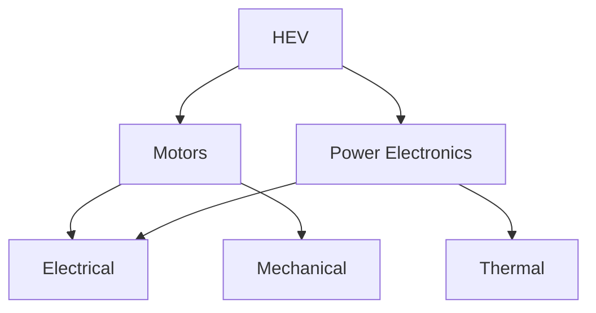
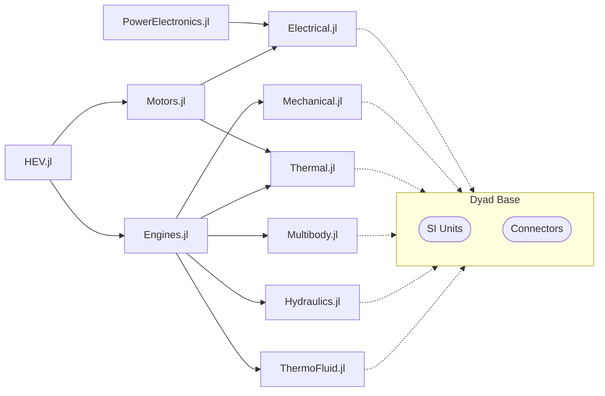

# Library Design

Ultimately, Dyad code is all about building libraries. Generally speaking,
there will be a "hierarchy" of libraries (dependencies) for any significant
modeling project. At the lowest level you will find the fundamental domain
libraries and at the top you'll generally find a library build to model a
specific product or system. In the middle you will likely find "vertical"
libraries that link these low-level domain libraries with the library of system
models, _e.g.,_



See [this section](#proposal) for a more detailed example on this topic.

## Naming

One issue we will have in the Dyad ecosystem is with package naming. Because
Dyad packages are normal Julia packages, they _compete_ with other Julia
packages for names. Furthermore, they will not be so easily distinguished from
other Julia packages.

So, for example, I might want to create an `Electrical.jl` library...but one
might already exists. Although this isn't currently the case, there are already
Julia packages with the names `ElectricFields`, `ElectricGrid`, `ElectricWires`,
`ElectricalEngineering`, `ElectroPhysiology` and `ElectromagneticFields`. So
the problem here is that the Julia package namespace is a crowded field with
many incumbents already. And the other problem is that a Dyad developer
might be looking for component models related to `ElectroPhysiology`, but that
library has nothing to do with Dyad...and this isn't so easy to tell from the
outside.

We should give some though to how to deal with this issue (_e.g.,_ a dedicated
Dyad registry?!?).

## Package Management

At the end of the day, Dyad generates **Julia Packages**. Not only does this
mean that we can directly use `ModelingToolkit` to create and transform
mathematical models, it means _we can leverage the Julia Package Manager_,
`Pkg`, which allows us to quite easily create modular, reusable libraries of
component and system models.

### Modules

Note that the Julia language supports having multiple modules per package and
_so does Dyad_. In fact, when creating Dyad code all files in the same
directory are all assumed to be part of the same module (no `import`s or
`include`s are necessary to establish this relationship either). When the
Dyad code generator is run, it will create the necessary `module` entities in
Julia. All generated code is places in the `src` directory of the Julia package
and the files are named using the module names as prefixes so that each module
can be clearly identified.

Note that the same Julia package that contains the Dyad code may _also_
contain functions (used by the models). As such, the Dyad code generator is
careful in only writing to files that follow a specific naming convention so as
to avoid _overwriting_ any other, non-Dyad files. For example, in the
`Electrical` library, the root level module is written to
`Electrical_components.jl`. Similarly, any experiments (functions which perform
solutions) are written to `Electrical_experiments.jl`.

### Testing

The Dyad code generator also generates tests associated with component models
and places them in the `test` directory. In the case of the `Electrical`
library, the tests are written to a file named `Electrical_tests.jl`.

The following Dyad metadata demonstrates the kind of metadata used to define
a test (and an experiment):

```dyad
metadata {
  "Dyad": {
    "experiments": {
      "simple": { "start": 0, "stop": 10.0, "initial": { "capacitor.v": 10, "inductor.i": 0 } }
    },
    "tests": {
      "case1": {
        "stop": 10,
        "initial": { "capacitor.v": 10, "inductor.i": 0 },
        "expect": {
            "initial": {
                "t": 0,
                "capacitor.v": 10.0
            },
            "final": {
                "t": 10.0
            }
        }
      }
    }
  }
}
```

When such metadata is found, the Dyad code generator will automatically
create tests. First, the assumption is that any defined experiments should run
to completion without error. Second, the tests should also run without error
but additional "assertions" are also generated based on the expected results
defined in the metadata. So the above metadata leads to the following code:

```julia
@test try
    simple()
    true
catch
    false
end

@testset "Running test case1 for RLCModel" begin
  @mtkbuild model = RLCModel()
  u0 = [model.capacitor.v => 10, model.inductor.i => 0]
  prob = ODEProblem(model, u0, (0, 10))
  sol = solve(prob)
  @test sol.t[1] ≈ 0
  @test sol[model.capacitor.v][1] ≈ 10
  @test sol.t[end] ≈ 10
end
```

### Pre-Compilation

Finally, the Dyad code generator _also_ creates precompilation setup code for
the package itself. This is another example where the definition of experiments
add value to the resulting Julia code. Using the same metadata shown [in the
previous section](#testing), the Dyad code generator will also generate the
following precompilation setup code:

```julia
using PrecompileTools: @setup_workload, @compile_workload

@setup_workload begin
    @compile_workload begin
      simple()
    end
end
```

where the `simple` function was also generated and looks like this:

```julia
"""Run model RLCModel from 0 to 10"""
function simple()
  @mtkbuild model = RLCModel()
  u0 = [model.capacitor.v => 10, model.inductor.i => 0]
  prob = ODEProblem(model, u0, (0, 10))
  sol = solve(prob)
end
export simple
```

Doing so ensures that all functions used to instantiate component models for the
`RLCModel` system will be precompiled along with any solver related code that is
used in the solution of that system.

## "Standard Library"

### Dyad vs. Modelica

The Modelica modeling language features a "standard library". This standard
library is quite comprehensive and has been curated by the Modelica Association
for many years. As such, it is generally a very high quality Modelica library.

However, the problem with the library is that everybody wants their models to be
in the Modelica Standard Library. Why? Because Modelica doesn't have any kind
of official package manager or package registry. As a result, adding package
dependencies to a project can be somewhat tedious...unless the components are in
the Modelica Standard Library because that is bundled by all available tools.
So, naturally, everybody wants their components in the Modelica Standard Library
so they can avoid having to load additional libraries.

As [mentioned previously](#package-management), Dyad leverages the Julia
package manager and all the functionality that that brings with it. So for us,
the need for a "standard library" is not really as strong. Yes, the community
will benefit from a collection of high quality, validated component models
across a range of domains. But in Dyad, **they don't all have to be in the
same library**. This is multiple benefits:

- With the Modelica Standard Library, the job of managing the library is
  daunting because it is so large and spans so many domains. It is difficult to
  find people to do this work as a result.
- People rarely use everything the Modelica Standard Library...but they pay the
  price every time they load the library. Breaking the component models into
  separate libraries means finer grained dependencies and less unnecessary
  loading.

### Proposal

Because of these factors, the best approach for Dyad is likely to have
smaller packages focused on specific domains. There is only one problem with
this..._multi-domain components_. Imagine, for example, an electric motor. It
has both electrical _and_ rotational connectors. Does it belong in the
"electrical" library or the "rotational" library?

But this problem is actually quite easy to address. The complication with
multi-domain components is really that they need connector definitions from
multiple domains. In the Modelica Standard Library, the packages are organized
by domain and each domain specific library contains both connector and component
model definitions. However, the Dyad ecosystem can avoid quite a bit of
complexity by simple defining a small, _built in_ package that contains **only
connector definitions and SI unit definitions** from across the various domains.
Given such a package, then components like electric motors (electrical and
rotational), power electronics (electrical and thermal), _etc_ can be defined
anywhere without any explicit dependencies. This is analogous to the `Base`
package in Julia.

In this way, packages can be kept smaller and more modular. We can imagine a
future Dyad ecosystem with the following packages (with their dependencies
listed underneath each package)



As we can see in this figure, all the basic domain component libraries can be
written without any explicit dependencies because everything they need is
already available to them. Furthermore, we can be sure that these domains are
all implicitly compatible with each other because they will be built on the same
physical types (_e.g.,_ `Voltage`) and the same connectors. From there,
"vertical" libraries for things like engines and motors emerge and then finally
we see "application" libraries for things like hybrid electric vehicles.

In this way, someone interested in electric motor models needs only a fraction
of the packages shown and doesn't need to pay the "tax" of loading (and
precompiling) a bunch of unrelated libraries.

### Plan and Priorities

We should start with the following component libraries.

- Blocks
- Electrical
- Mechanical
- Thermal
- Hydraulics

Below is a more detailed plan for each library of what is required and in what
order. Note, there will be many cases where Dyad is simply not yet capable
of describing the models to be created. **This needs to be tracked and reported
so we can prioritize the development of the Dyad toolchain**.

#### Blocks

An initial version of this library has been created [here](https://github.com/JuliaComputing/BlockComponents).

The block components to be implemented and be roughly the models contained in
the following Modelica Standard Library packages and in the order presented
below:

1. [Continuous](https://doc.modelica.org/Modelica%204.0.0/Resources/helpDymola/Modelica_Blocks_Continuous.html#Modelica.Blocks.Continuous):
   The `Lim*` variants are the lowest priority. Furthermore, we should discuss
   `TransferFunction` and `StateSpace` implementations with Fredrik.
2. [Math](https://doc.modelica.org/Modelica%204.0.0/Resources/helpDymola/Modelica_Blocks_Math.html#Modelica.Blocks.Math):
   Focus first on `Sources` and the SISO blocks and then worry about the fancier
   blocks. All the signal processing blocks that perform reductions over some
   prescribed period are of lower priority.
3. [Tables](https://doc.modelica.org/Modelica%204.0.0/Resources/helpDymola/Modelica_Blocks_Tables.html#Modelica.Blocks.Tables):
   It would be useful to have implementations for every `CombiTable*`
   implementation. This is already requested in [this
   issue](https://github.com/JuliaComputing/JuliaSim.jl/issues/753)
4. Examples: We don't necessarily need to use the same examples from the
   Modelica Standard Library, but we should have good coverage of the components
   we've implemented.

These should be implemented in Dyad modules that mirror the Modelica
subpackage names.

Note, Boeing has some very specific needs here so we may need to either augment
this list based on their needs or to simple create a separate component library
specific for Dyad that can satisfy the regulatory requirements that come
with safety critical designs.

#### Electrical

An initial version of this library has been created [here](https://github.com/JuliaComputing/Electrical.jl).

For now, let us focus exclusively on the `Analog` package. The electrical
components to be implemented and be roughly the models contained in the
following Modelica Standard Library packages and in the order presented below:

1. [Sources](https://doc.modelica.org/Modelica%204.0.0/Resources/helpDymola/Modelica_Electrical_Analog_Sources.html#Modelica.Electrical.Analog.Sources)
2. [Basic](https://doc.modelica.org/Modelica%204.0.0/Resources/helpDymola/Modelica_Electrical_Analog_Basic.html#Modelica.Electrical.Analog.Basic)
3. [Ideal](https://doc.modelica.org/Modelica%204.0.0/Resources/helpDymola/Modelica_Electrical_Analog_Ideal.html#Modelica.Electrical.Analog.Ideal)
4. [Sensors](https://doc.modelica.org/Modelica%204.0.0/Resources/helpDymola/Modelica_Electrical_Analog_Sensors.html#Modelica.Electrical.Analog.Sensors)
5. [Semiconductors](https://doc.modelica.org/Modelica%204.0.0/Resources/helpDymola/Modelica_Electrical_Analog_Semiconductors.html#Modelica.Electrical.Analog.Semiconductors)
6. Examples: We don't necessarily need to use the same examples from the
   Modelica Standard Library, but we should have good coverage of the components
   we've implemented.

These should be implemented in Dyad modules that mirror the Modelica Standard
Library subpackage names.

#### Mechanical

An initial version of this library has been created [here](https://github.com/JuliaComputing/MechanicalComponents).

For now, let us focus exclusively on the `Rotational` and `Translational`
packages (in no particular order). Each of these should be implemented using
nested Dyad modules that mirror the structure of the Modelica Standard
Library subpackage names.

#### Thermal

An initial version of this library has been created [here](https://github.com/JuliaComputing/ThermalComponents).

For now, let us focus exclusively on the `HeatTransfer` package. The thermal
components to be implemented and be roughly the models contained in the
following Modelica Standard Library packages and in the order presented below:

1. [Sources](https://doc.modelica.org/Modelica%204.0.0/Resources/helpDymola/Modelica_Thermal_HeatTransfer_Sources.html#Modelica.Thermal.HeatTransfer.Sources)
2. [Components](https://doc.modelica.org/Modelica%204.0.0/Resources/helpDymola/Modelica_Thermal_HeatTransfer_Components.html#Modelica.Thermal.HeatTransfer.Components)
3. [Sensors](https://doc.modelica.org/Modelica%204.0.0/Resources/helpDymola/Modelica_Thermal_HeatTransfer_Sensors.html#Modelica.Thermal.HeatTransfer.Sensors)
4. Examples: We don't necessarily need to use the same examples from the
   Modelica Standard Library, but we should have good coverage of the components
   we've implemented.

#### Hydraulic

An initial version of this library has been created [here](https://github.com/JuliaComputing/HydraulicComponents).

The hydraulic components to be implemented and be roughly the models contained
in the following Modelica Standard Library `Fluid` package and in the order
presented below:

1. [Vessels](https://doc.modelica.org/Modelica%204.0.0/Resources/helpDymola/Modelica_Fluid_Vessels.html#Modelica.Fluid.Vessels)
2. [Pipes](https://doc.modelica.org/Modelica%204.0.0/Resources/helpDymola/Modelica_Fluid_Pipes.html#Modelica.Fluid.Pipes)
3. [Valves](https://doc.modelica.org/Modelica%204.0.0/Resources/helpDymola/Modelica_Fluid_Valves.html#Modelica.Fluid.Valves)
4. [Fittings](https://doc.modelica.org/Modelica%204.0.0/Resources/helpDymola/Modelica_Fluid_Fittings.html#Modelica.Fluid.Fittings):
   This includes the `Orifices` and `Bends` subpackages
5. [Sources](https://doc.modelica.org/Modelica%204.0.0/Resources/helpDymola/Modelica_Fluid_Sources.html#Modelica.Fluid.Sources)
6. [Sensors](https://doc.modelica.org/Modelica%204.0.0/Resources/helpDymola/Modelica_Fluid_Sensors.html#Modelica.Fluid.Sensors)

Our focus, for now, should be on single phase fluids and components that are
largely for lubrication and actuation and _not_ multi-phase fluids.

### Classification

Note that displaying available components to users is a challenging product. A
simple way to do this is simply to organize components by the component library
they belong to. However, that is only on possible way to organize them.
Another way to organize them is by domain but the tricky part here is that **the
same component can belong to multiple domains**. For example, an electrical
motor is not just electrical and mechanical, if it is not 100% efficient it is
also a thermal component. For this reason, we will need to introduce some
standard metadata to indicate the "domain" the component belongs to. But domain
itself is only one potential criteria but there are many potential other domains
(_e.g.,_ associated subsystems, keyword, _etc._). So we still need to consider
exactly how we will specify this additional metadata but we can nevertheless
understand that organizing components strictly by the component library they
belong to is not the only option.
