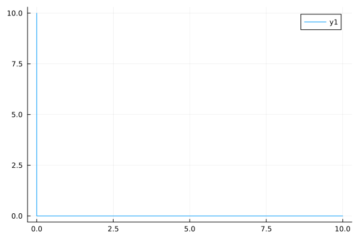
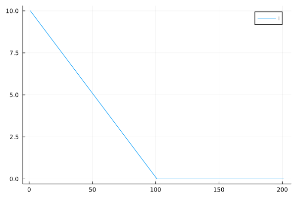
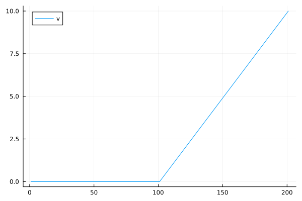
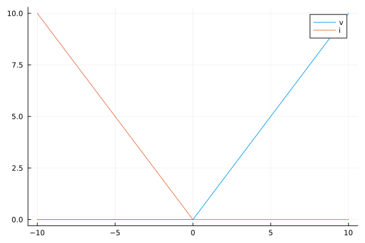
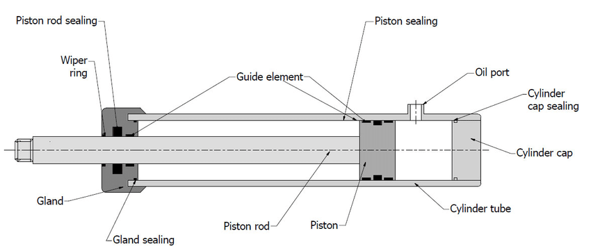
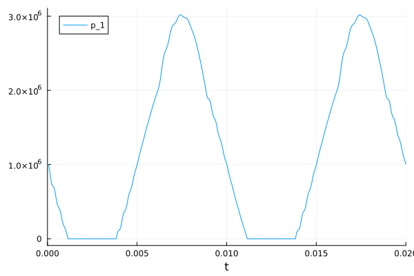
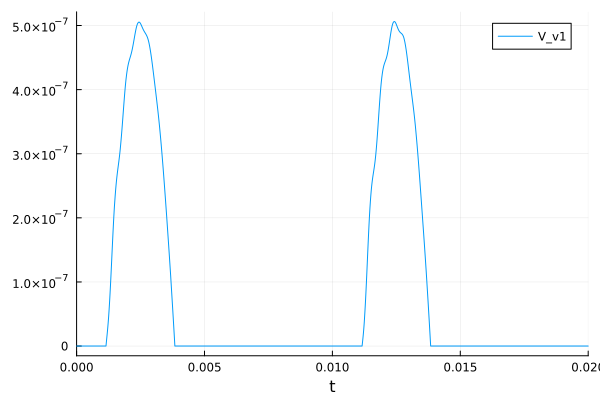

# S-Parameterization

In acausal models components the focus is on describing the relationship between
the `potential` and `flow` variables on a connector. For example, with Ohm's
law we have:

$$ v = i R $$

...where $v$ is the potential variable (or difference in potential variables)
and $i$ is the flow through the component.

Most components can quite easily be described via some combination of
constitutive equations and conservation laws.

## The Problem

It turns out that there are a bunch of interesting kinds of behavior that are
not so easy to represent in this way. The reason is that the formulation of
these components **does not allow** the relationship between these variables to
be expressed by a function.

In the case of Ohm's law, we can conceptually think of this as:

$$ v = f(i) $$

Similarly, the relationship can also be inverted into:

$$ i = f^{-1}(v) $$

But what if neither of these are possible? A classic example of such a problem
is an ideal diode. If you plot the voltage across an ideal diode and the
current through the same diode, you get a curve like this:



As should be obvious, we can't represent this behavior in terms of $v = f(i)$ or
$i = f(v)$. So what can we do?

## The Solution

The answer is quite simple and typically covered in most [calculus
classes](https://en.wikipedia.org/wiki/Parametric_equation). All we need to do
is to write these two variables _in terms of a third_. So for our ideal diode
case, we can just write (in Julia):

```julia
v = s -> s < 0.0 ? 0.0 : s
i = s -> s < 0.0 ? -s : 0.0
```

If we plot each of them individually, they look like this:





Looking at them on the same plot we get:



So in Dyad this would look something like this:

```
component IdealDiode
  extends TwoPin
  variable s::Real
relations
  v = if s < 0 then 0 else s
  i = if s < 0 then -s else 0
end
```

Note that normally a `TwoPin` component (like `Resistor`) only needs to specify
a single equation, _e.g._

```
component Resistor
  extends TwoPin
  parameter R::Resistance
relations
  v = i * R
end
```

But in the case of the `IdealDiode` we need to provide two equations because we
have introduced an additional variable, `s`.

Now, what some people do in this circumstances is to simply make the diode
slightly less than ideal (which, to be honest, isn't so unreasonable because
no diode is truly ideal). But there are two reasons why this can be a bad idea.
One is that the behavior is actually the real behavior of the component (which
is not the case for our diode but is the case for the [clutch
model](#automotive-clutch) example below). The other is that the ideal model
has much better numerical properties. For the diode here we may not get a
really bad condition number by making these lines slightly off from vertical or
horizontal, but there are cases (see [check valve example](#check-valve) below)
where there can be a big penalty.

## Practical Examples

Where do these kinds of problems arise? Well, the ideal diode is one case. But
here are a few more:

### Automotive Clutch

In the case of an automotive clutch, if we plot the torque transmitted through
the clutch as a function of the relative speed across the clutch, we get
something like this:


Note that we cannot write an explicit function for torque as a function of
relative speed nor a function for relative speed as a function of torque. But
what we can do is write torque and relative speed as functions of some third
variable (just as we did with the ideal diode).

You can find a much more detailed discussion of this use case in the following
two blog posts:

- https://whiteboard.modelica.university/blog/part-1-friction/
- https://whiteboard.modelica.university/blog/part-2-kinematic/

### Check Valve

In hydraulic systems, a check valve is analogous to a diode. But the thing
about a check valve is that fluid models can be quite non-linear AND you can
easily get yourself into a situation where the valve "chatters" (opens and
closes quickly).

In the case of the check valve, we would define $\Delta p$ and $\dot{m}$ in
terms of $s$ as follows:

$$
\dot{m} =
\begin{cases}
-s & s<0 \\
0 & s \geq 0
\end{cases}
$$

Likewise for $\Delta p$:

$$
\Delta p =
\begin{cases}
0 & s<0 \\
s & s \geq 0
\end{cases}
$$

If you actually model the check valve with a spring and a mass, you'll get
dynamics that can cause the valve to chatter or oscillate. Now in some cases
you may care about that (_i.e._ you are actually trying to design the check
valve itself). But in many cases, you just want the check valve to perform its
function (bleed off excess pressure) without have to "calibrate" it or deal with
the dynamics (which can potentially slow down your simulation significantly).

### Cavitation

Another interesting example I've seen in practice is related to cavitation.
Imagine you have a hydraulic piston like this one:



Now imagine that the oil port is closed off and you are pulling on the piston
rod to the left. As you do so, the pressure in the cylinder drops. But what
happens if the absolute pressure in the cylinder drops below zero (absolute)
pressure?

In reality, gasses trapped in the oil will be released and eventually the oil
will vaporize. As they say, "nature abhors a vacuum" so some kind of matter
will fill it. But evaporation is a tricky thing to model and it also leads to
very stiff dynamics if you really want to model it.

But do you really need/want to?

An alternative is consider formulate the cylinder such that it is composed of
two volumes. The first is the volume of the fluid and the other is the "void
volume" (_i.e.,_ empty space).

Normally you would write:

$$ m = \rho V $$

...and then relate the volume to the piston position, $x$.

$$ V = A (x+x_0) $$

But let's change this so that the total volume is broken into the fluid volume,
$V_f$ and the void volume, $V_v$.

In this case, the mass in the cylinder is only related to the fluid volume,
_e.g.,_

$$ m = \rho V_f $$

But the piston position is related to volume as follows:

$$ V_f + V_v = A (x+x_0) $$

But the problem is that we now have the same equations but we have an additional
variable since we split $V$ into $V_f$ and $V_v$. But this is where our
parametric formulation comes in. We define $p$ in the cylinder and $V_v$ in
terms of a third parameter, $s$. For the void volume, $V_v$, we get:

$$
V_v =
\begin{cases}
-s & s<0 \\
0 & s \geq 0
\end{cases}
$$

..and for the pressure, $p$ we get:

$$
p =
\begin{cases}
0 & s<0 \\
s & s \geq 0
\end{cases}
$$

The best way to think about this is that $s$ is like the pressure (we see this
because when $s$ is positive, _it is the pressure_). But imagine starting with
a positive value of $s$. So far so good, $V_v$ is zero and $p$ is above
zero...just like the model without the parameterization.

But as $s$ drops, it crosses zero. Then what happens. Well, $p$ _stays the
same_ (_i.e.,_ we do not get a negative absolute pressure, it just holds there).
This is what would happen in an actual fluid system. The fluid cannot resist
the cylinder once cavitation starts to occur...there is nowhere for it to
generate more force on its side.

But what also happens once $s$ goes below zero is that the void volume, $V_v$,
increases. What this means is that the piston can continue moving to the left
(which, again, is what happens in real life because the cylinder cannot resist
any more).

With this approach, you get something that lines up very well with the actual
physical response of the system without having to model any complex physics nor
having to deal with strong non-linearities or stiffness. And if you system
never experiences cavitation then $s$ will always remain positive and your
component behave just like the component would if we were solving in terms of
$p$ instead of $s$.

[This model](./sim.jl) implements this for cavitation and it runs (with the right solver). Here are two plots to demonstrate how pressure and void volume "trade off" with each other:





## Caveats

This approach probably won't work if $s$ is chosen as a state. This doesn't
really happen in the hydraulic example but it could happen in the clutch example
if you don't do the workaround used in the Modelica standard library to avoid
that.
