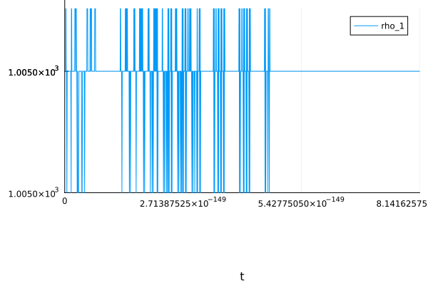
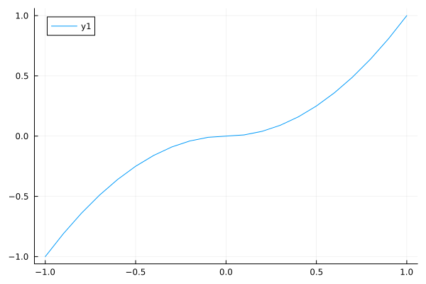
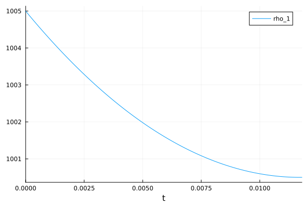
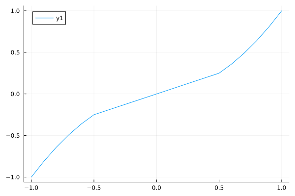
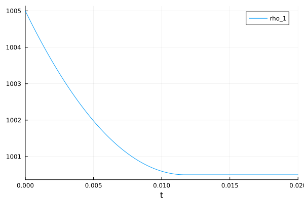
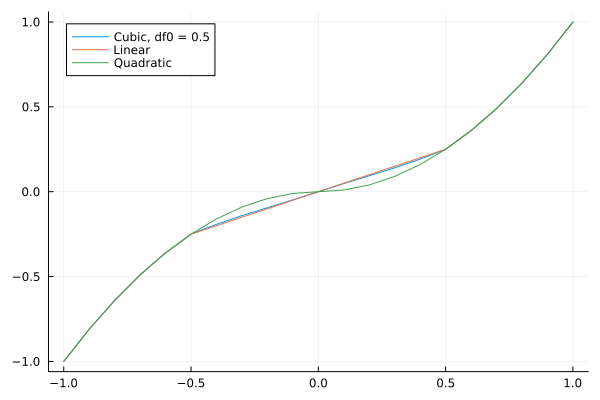

# Modeling Isentropic Flow

It is common when modeling fluid systems to model a nozzle, orifice, valve,
_etc_. as an isentropic process. Details of what this involves can be found
[here](https://en.wikipedia.org/wiki/Isentropic_nozzle_flow) and
[here](https://www.grc.nasa.gov/www/k-12/airplane/isentrop.html) (among others).

## Equations

An example of using the isentropic flow assumptions can be seen below:

$$
\begin{align}
\frac{\mathrm{d} x\left( t \right)}{\mathrm{d}t} &= \mathtt{dx}\left( t \right) \\
\frac{\mathrm{d} \mathtt{dx}\left( t \right)}{\mathrm{d}t} &= \mathtt{ddx}\left( t \right) \\
\frac{\mathrm{d} \mathtt{\rho\_1}\left( t \right)}{\mathrm{d}t} &= \mathtt{d\rho\_1}\left( t \right) \\
\frac{\mathrm{d} \mathtt{\rho\_2}\left( t \right)}{\mathrm{d}t} &= \mathtt{d\rho\_2}\left( t \right) \\
0 &=  - \mathtt{dm\_1}\left( t \right) + A \left( L + x\left( t \right) \right) \mathtt{d\rho\_1}\left( t \right) + A \mathtt{dx}\left( t \right) \mathtt{rho\_1}\left( t \right) \\
0 &= \mathtt{dm\_2}\left( t \right) + A \left( L - x\left( t \right) \right) \mathtt{d\rho\_2}\left( t \right) - A \mathtt{dx}\left( t \right) \mathtt{\rho\_2}\left( t \right) \\
0 &=  - \mathtt{p\_s} + \mathtt{p\_1}\left( t \right) + \left|u_1(t)\right| u_1(t) C \mathtt{\rho\_0} \\
0 &= \mathtt{p\_r} - \mathtt{p\_2}\left( t \right) + \left|u_2(t)\right| u_2(t) C \mathtt{\rho\_0}
\end{align}
$$

## Julia code

Brad Carman created the following as a kind of benchmark for this problem:

```julia
function System(reg_pow; name)
    pars = @parameters begin
        rho_0 = 1000
        beta = 2e9
        A = 0.1
        m = 100
        L = 1

        p_s = 100e5
        p_r = 10e5
        C = 1.35
        c = 1000
        A_p = 0.00094

        transition = 0.1
    end
    vars = @variables begin
        p_1(t) = p_s
        p_2(t) = p_r
        x(t) = 0
        dx(t) = 0
        ddx(t), [guess = 0]
        rho_1(t), [guess = rho_0]
        rho_2(t), [guess = rho_0]
        drho_1(t), [guess = 0]
        drho_2(t), [guess = 0]
        dm_1(t), [guess = 0]
        dm_2(t), [guess = 0]
        u_1(t), [guess = 0]
        u_2(t), [guess = 0]
    end

    eqs = [
        D(x) ~ dx
        D(dx) ~ ddx
        D(rho_1) ~ drho_1
        D(rho_2) ~ drho_2
        u_1 ~ dm_1 / (rho_0 * A_p)
        u_2 ~ dm_2 / (rho_0 * A_p)
        +dm_1 ~ drho_1 * (L + x) * A + rho_1 * dx * A
        -dm_2 ~ drho_2 * (L - x) * A - rho_2 * dx * A
        rho_1 ~ rho_0 * (1 + p_1 / beta)
        rho_2 ~ rho_0 * (1 + p_2 / beta)
        m * ddx ~ (p_1 - p_2) * A - c * dx
        (p_s - p_1) ~ C * rho_0 * reg_pow(u_1, 2, transition)
        (p_2 - p_r) ~ C * rho_0 * reg_pow(u_2, 2, transition)
    ]
    return ODESystem(eqs, t, vars, pars; name)
end
```

## The Problem

Let's start by just using a naïve approach and building our system as follows:

```julia
function naive(x, order, delta)
    sign(x)*abs(x)^order
end

@mtkbuild sysn = System(naive)
probn = ODEProblem(sysn, [], (0, 0.02))
soln = solve(probn, Rodas5P())
```

You can see the results (in terms of $\rho_1$) here:



You can see we don't get very far in time. This reminds me of a quote from "The
Hitchhiker's Guide to the Galaxy":

> This has made a lot of people very angry and been widely regarded as a bad
> move.

Running `solve` on this returns an `Unstable` result which is why the simulation
doesn't actually complete.

The reason for this is the following equations:

$$
(p_s - p_1) = C \rho_0 \left|u_1\right| u_1 \\
(p_2 - p_r) = C \rho_0 \left|u_2\right| u_2
$$

These are the equations that result from using `naive` as our function to square
the velocities.

Plotting the `naive` function (_e.g._ ) it isn't obvious what the issue is:



The issue is that the solver needs to invert this function. We'll come back to
this later.

This formulation has been a thorn in people's sides for a long time. I remember
when I first started doing modeling of in-cylinder flow at Ford, I was speaking
with Prabhakar Patil (then Chief Engineer of the Ford Hybrid Escape) and he said
that he used to do engine modeling but gave up because "those are the stiffest
equations I've ever seen". Similarly, [this
paper](https://modelica.org/events/workshop2000/proceedings/Soejima.pdf)
describes Toyota's difficulties in running engine simulations on an HiL system.
Note Figure 5 and how the system goes unstable when _the pressures are close
together_.

### Changing Things Around a Bit

One issue with the sample problem above is that it starts when the pressures are
close together but then pushes them to be far apart. There is nothing wrong
with starting under such conditions (it is actually a typical starting
condition, _i.e.,_ everything is in equilibrium). But the system will often
_return_ to this state many times as well. So let's change the problem
statement around a bit so that we can better judge how different approximations
will function with repeated equilibrium.

The change here is minor, we'll change `p_r` and `p_s` so that they are _the
same_ and change their initial conditions so that they start off differently.
In this case, our `System` function then becomes:

```julia
function System(reg_pow; name)
    pars = @parameters begin
        rho_0 = 1000
        beta = 2e9
        A = 0.1
        m = 100
        L = 1

        p_s = 10e5
        p_r = 10e5
        C = 1.35
        c = 1000
        A_p = 0.00094

        transition = 0.1
    end
    vars = @variables begin
        p_1(t) = 100e5
        p_2(t) = 100e5
        x(t) = 0
        dx(t) = 0
        ddx(t), [guess = 0]
        rho_1(t), [guess = rho_0]
        rho_2(t), [guess = rho_0]
        drho_1(t), [guess = 0]
        drho_2(t), [guess = 0]
        dm_1(t), [guess = 0]
        dm_2(t), [guess = 0]
        u_1(t), [guess = 0]
        u_2(t), [guess = 0]
    end

    eqs = [
        D(x) ~ dx
        D(dx) ~ ddx
        D(rho_1) ~ drho_1
        D(rho_2) ~ drho_2
        u_1 ~ dm_1 / (rho_0 * A_p)
        u_2 ~ dm_2 / (rho_0 * A_p)
        +dm_1 ~ drho_1 * (L + x) * A + rho_1 * dx * A
        -dm_2 ~ drho_2 * (L - x) * A - rho_2 * dx * A
        rho_1 ~ rho_0 * (1 + p_1 / beta)
        rho_2 ~ rho_0 * (1 + p_2 / beta)
        m * ddx ~ (p_1 - p_2) * A - c * dx
        (p_s - p_1) ~ C * rho_0 * reg_pow(u_1, 2, transition)
        (p_2 - p_r) ~ C * rho_0 * reg_pow(u_2, 2, transition)
    ]
    return ODESystem(eqs, t, vars, pars; name)
end
```

Running these systems, we _can still see the issue_ with the naive approach
because the simulation will not run out beyond $0.118$ seconds as shown in the
figure below:



In this case, the `retcode` returned by `solve` is `MaxIters`.

## Solutions

### Linearize

So the first solution is to create a function that, for some region around zero
velocity, approximates the behavior with a straight line, _e.g.,_



The Julia code for this is:

```julia
function reg_linear(x, order, delta)
    ifelse(abs(x) > delta, sign(x) * abs(x)^order, x / delta * delta^order)
end

@mtkbuild sysl = System(reg_linear)
probl = ODEProblem(sysl, [], (0, 0.02))
soll = solve(probl, Rodas5P())
```

This solutions is completely reasonable and works pretty well. We can see the
solution to this here:



Note that we are able to run past $0.118$ seconds. So that's good. It is worth
nothing that if we run `soll = solve(probl, Rodas5P())` we get `235.875 μs (1555
allocations: 194.81 KiB)`. That's a useful baseline, let's see if we can do
better.

### Cubic Interpolation

Let's assume $u$ (the velocity that we are squaring) has a value such that
$\left|u\right| < \delta$. In the linearized case, we just assumed that $u$ was
linear in that region such that when $u=\delta$, the linearized value matched
$\left|u\right| u$. But let's assume that we use a cubic polynomial of the
form:

$$
f(u) =
\begin{cases}
a u^3 + b u^2 + c u + d & u<\delta \\
u^2 & u \geq \delta
\end{cases}
$$

Note, we will deal with the symmetry of this later, for now we are only
concerning ourselves with the case where $u \geq 0$. In this case, we need to
solve for $a$, $b$, $c$ and $d$.

#### Condition 1: $f(0) = 0$

Let's start with the fact that our function,
$f$, should return $0$ if we pass in $0$, _i.e._ $f(0) = 0$. If we plug $u=0$
into our polynomial, we get $f(0) = d$. Therefore, we already know that $d=0$.

#### Condition 2: Continuity

Now let's also recognize that our function, $f$, should be continuous as we
cross over the transition from $u<\delta$ to $u>\delta$. That means:

$$
f(\delta) = \delta^2 = a \delta^3 + b \delta^2 + c \delta
$$

Note, this equation already takes into account the fact that $d$ is zero. From
this, we can derive the following equations:

$$
1 = a \delta + b + c / \delta
$$

...or just...

$$
b = 1 - a \delta - c / \delta
$$

#### Condition 3: Continuous Derivative

But there are two more conditions we can apply. The first is that not only
should the function be continuous at $u=\delta$ but that the _derivative_ should
be continuous as well. So that gives us:

$$
f'(\delta) = 2 \delta = 3 a \delta + 2 b \delta + c
$$

#### Condition 4: Derivative at origin

Finally, we have the derivative of our function at $u=0$. Let's call this
$f'_0$. Since:

$$
f'(u) = 3 a u^2 + 2 b u + c
$$

We can see that when $u=0$:

$$
f'(0) = c = f'_0
$$

We have the freedom to pick $f'_0$ to be any value we want (more on this in a
second) so we are really left with two equations and two unknowns:

#### Putting It All Together

Since we pick $f'_0$ and $\delta$, we don't need to solve for those, we can
treat those as "knowns". Furthermore, since we know $d=0$ we don't need to solve
for that either. This leaves us with two equations that we use to solve for $a$
and $b$:

$$
b = 1 - a \delta - f'_0 / \delta \\
2 \delta = 3 a \delta + 2 b \delta + f'_0
$$

Plugging $b$ into the second equation we get:

$$
2 \delta = 3 a \delta + 2 \delta (1 - a \delta - f'\_0 / \delta) + f'\_0
$$

$$
2 \delta = 3 a \delta + 2 \delta - 2 a \delta^2 - 2 f'\_0 + f'\_0
$$

$$
f'_0 = a (3 \delta - 2 \delta^2)
$$

Rearranging to solve for $a$, we get:

$$
a = \frac{f'_0}{3 \delta - 2 \delta^2}
$$

Plugging this back into $b$ gives us:

$$
b = 1 - \frac{f'_0}{3-2 \delta} - f'_0 / \delta \\
$$

With this information in hand, we can write a Julia function that will
generate a function we can use to approximate squaring the velocity:

```julia
function build_smooth(delta, df0)
    c = df0
    a = df0 / (3 * delta - 2 * delta^2)
    b = 1 - df0 / (3 - 2 * delta) - df0 / delta
    function reg_smooth(x, order, ignored)
        f = a * x^3 + b * abs(x) * x + c * x
        f
    end
end
```

Note that we can pick the value of `delta` to use as well as the value of
$f'_0$.  For our purposes, we'll choose a value of `delta` of $0.5$ and we'll
choose a value of $f'_0$ such that the slope matches our linearized version
(which, in practice, means $f'_0 = \delta$, BTW).  Also note the use of `abs(x)`
in our evaluation of the polynomial. This makes this into an [odd
function](https://en.wikipedia.org/wiki/Even_and_odd_functions#Odd_functions)
which is the type of symmetry we want in this case.

Plotting each variation together we see:



So our cubic version provides the same slope at the origin and the same value
for the function a $u=\delta$ as our linear version.  However it also provides a
smooth derivative at the transition point.  **But does this matter?**

We can test this with the following Julia code:

```julia
@mtkbuild syss0 = System(build_smooth(0.5, 0.5))
probs0 = ODEProblem(syss0, [], (0, 0.02))
sols0 = solve(probs0, Rodas5P())
```

### Comparisons

Let's look at how these two methods compare.  As we've seen, the functions are
very close to each other.  So they all appear to be reasonable approximations.
Note that all the approximations we are discussing here have a derivative that
is _non zero_ at the origin.  We can, with the cubic method, select a $f'_0$
that is zero...and we see the same issue as the normal $\left|u\right|u$
function (instabilities when the pressures are close to each other).  But all
the other approaches avoid that issue (this is the crux of Chris' contention
that the system is structural index-1 but numerically index-2 when the pressures
are equal).

#### Solutions

If we are going to compare these methods, the first obvious thing we want to
check is how the results compare, _i.e.,_ do we get the same answer?

Clearly, the answer is yes.

Another question to ask of both methods is, how big should `delta` be?  Well, in
my experimentation the results are pretty much the same until `delta` gets to
around 20.  Here is a plot comparing the linear approximation with different
values of `delta`:


The unapproximated model gives the same result as the approximated with small
`delta` values up until the unapproximated model fails.  So the bottom line is,
that the `delta=0.5` model is pretty much "the answer" (_i.e.,_ `delta` is
sufficiently small there that you can't see much difference).

#### Performance

Now the question is, which one performs better.  For this case I'm going to use
a value of `delta=20` because that is probably going to give us the best
performance vs. accuracy trade-off when compared against the unapproximated system.

Just to be clear, both approximations give the same answer for `delta=20`:


Running `@benchmark` on the `solve` for each, we get the following results for
the linear system:

```
BenchmarkTools.Trial: 10000 samples with 1 evaluation.
 Range (min … max):  142.500 μs …  57.341 ms  ┊ GC (min … max): 0.00% … 99.42%
 Time  (median):     157.625 μs               ┊ GC (median):    0.00%
 Time  (mean ± σ):   168.771 μs ± 648.955 μs  ┊ GC (mean ± σ):  5.19% ±  1.41%

          ▃▄▅▃▃▅█▆▄▃▄▃▂▂ ▁                                       
  ▁▂▂▃▂▂▃▇████████████████▇██▇▆▆▆▆▆▅▅▅▄▄▄▃▃▃▃▃▂▂▂▂▂▂▂▂▂▂▁▁▁▁▁▁▁ ▄
  142 μs           Histogram: frequency by time          192 μs <

 Memory estimate: 156.81 KiB, allocs estimate: 1248.
```

While the cubic approximation gives:

```
BenchmarkTools.Trial: 10000 samples with 1 evaluation.
 Range (min … max):  204.042 μs …  62.124 ms  ┊ GC (min … max): 0.00% … 99.39%
 Time  (median):     225.166 μs               ┊ GC (median):    0.00%
 Time  (mean ± σ):   242.643 μs ± 709.415 μs  ┊ GC (mean ± σ):  5.96% ±  2.59%

        ▁▆▅▃▅██▆██▆▅▅▅▅▃▂▂▁▁                                     
  ▁▃▅▇▅▅█████████████████████▇▇▇▆▆▅▆▆▄▄▄▄▃▃▃▃▃▂▂▂▂▂▂▂▂▂▂▁▁▁▁▁▁▁ ▄
  204 μs           Histogram: frequency by time          276 μs <

 Memory estimate: 186.02 KiB, allocs estimate: 1497.
```

So for this case, the linear version is the clear winner.  But one more
interesting comparison here is to see the role that `delta` plays in
performance (not accuracy).  Recall that for these cases we used `delta` of 20.
But let's try a `delta` of 1.  Both values will keep the model stable and out
of trouble when pressures are close to each other.  But there is a definite
performance difference:

```
BenchmarkTools.Trial: 10000 samples with 1 evaluation.
 Range (min … max):  212.250 μs …  57.762 ms  ┊ GC (min … max): 0.00% … 99.38%
 Time  (median):     230.625 μs               ┊ GC (median):    0.00%
 Time  (mean ± σ):   245.176 μs ± 762.146 μs  ┊ GC (mean ± σ):  5.12% ±  1.72%

              ▄▆▆▆▇█▆▅▄▄▄▃▃▂▁▁                                   
  ▂▃▃▂▂▄▆█▆▆▆███████████████████▇▇▆▆▅▅▄▄▄▃▃▃▃▃▂▂▂▂▂▂▂▂▁▁▂▁▁▁▁▁▁ ▄
  212 μs           Histogram: frequency by time          268 μs <

 Memory estimate: 180.97 KiB, allocs estimate: 1482.
```

In summary, with `delta=20`, the linear method had a median time of 157.625 μs
whereas with `delta=1` the median time was 230.625 μs.  That's a 31% increase in
speed with negligible difference in accuracy.