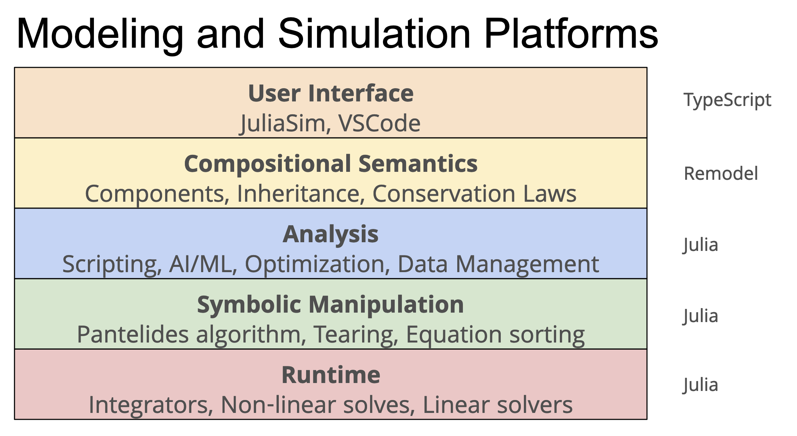

# Why Dyad?

Given what Dyad is, the next question is why was Dyad developed? To
understand that, it is necessary to understand the goals of Dyad:

## Goals

### Catalog all the information that, when taken together, would be called "a model"

Ultimately, the goal here is to avoid having different information about the
model scattered around. Specifically, the initial Dyad GUI contained _some_
information about the model (mostly about graphical appearance and layout) while
the Julia representation of the model contained other information (largely about
behavior). With the Dyad representation, all of this is managed together in a
single representation of the model.

It is important to note that the scope of information here is restricted to
information required to _compose_ a model. It doesn't include any imperative
functionality (that will be taken care of by Julia functions). As such, Dyad
is exclusively concerned with **the composition** of models. That is to say it
is about describing models.

### Create a human readable and writable concrete syntax for that information.

Once we identified all potential information required to compose models, we
ended up with what is effectively a JSON Schema for representing such models.
This by itself is useful because it means that these model descriptions can be
serialized and deserialized and therefore communicated between different
software systems.

But what was missing was the ability for a human to make sense of this. So for
that reason, we decided to include a _concrete_ syntax along with the abstract
syntax that had been developed. But always keep in mind, this is about
composition only and ultimately the Dyad language is **not** an imperative
language, it is a **declarative language**. As such, it doesn't have the same
types of semantic analyses to be performed on it.

An important aspect of the Dyad syntax is that it is possible to "round trip"
from concrete syntax to abstract syntax _back_ to concrete syntax. How this is
achieved and why it is necessary are discussed later in this documentation.

### Design a model representation with semantics we can reason about

As mentioned previously, Dyad is a declarative language, not an imperative one. The goal is to stay out of the Turing Tarpit and limit the expressiveness to semantics that we can reason about. This limited expressiveness may initially feel like a bug, but it is very much a feature. It may also seem frustrating but it is precisely this limited expressiveness that allows the overall approach to **scale**. Other tools provide lots of expressiveness or a shallow learning curve only to onboard users in such a way that they quickly paint themselves into corners. Ultimately, we want to grow a business that scales and so we need to take measures to protect for that.

### Implement a complete toolchain in Javascript/Typescript

Model composition is performed by the model developer. Generally, the model
developer will be developing these models in a browser, in VS code or using
command line tools. The one language that seamlessly supports all of these
different tooling environments is Javascript. So the Dyad tool chain was
developed as a series of Javascript package. The packages themselves are written
in [TypeScript](https://www.typescriptlang.org/) to provide a much richer type
system (and associated static checks).

The toolchain itself contains the necessary functionality to parse the Dyad
code, perform all semantic analysis on the code, and finally emit
ModelingToolkit compatible Julia code in the form of a Julia package.

This toolchain supports both an "interactive" mode and a "one pass" mode. The
interactive mode is used in browser based composition tools (like Dyad GUI)
as well as IDE environments like VS Code. In this mode, a persistent
representation of the models is kept in memory and manipulated by the
application. The semantic information is updated after each change to the code
base. The "one pass" mode is the more convention "compiler" mode and is used by
the [Dyad CLI](https://github.com/JuliaComputing/dyad-cli) to convert a
Dyad code base into a Julia package from the command line.

## Relation to Julia

So if we have Julia and Julia solves the two language problem, why are we developing Dyad?

Well the first thing to understand is that Dyad is not a language in the same sense that Julia is. Dyad is much more a "data model" with a human readable format than it is a programming language. Dyad is exclusively about describing how models are composed.

The next thing to keep in mind is that Dyad doesn't replace Julia. Not only are we still relying on the many foundational capabilities present in the Julia ecosystem as shown in the image below, we are still relying on Julia for all the imperative behaviors in models as well. There are no "functions" in Dyad. All imperative computations are still performed in Julia code.

Finally, a key reason Dyad exists is to act as a bridge between the UI world, where most UIs are being coded in Javascript, and the computational world where Julia's strength lies. Dyad doesn't exist to compete with Julia but rather to connect the capabilities of Julia and MTK to graphical user interfaces. As shown below, Dyad is the bridge that connects the UI aspects of an application to all the amazing capabilities present in the Julia ecosystem.

## Summary

In Summary, we use Dyad for _"Composition"_ and Julia for _"Computation"_.
