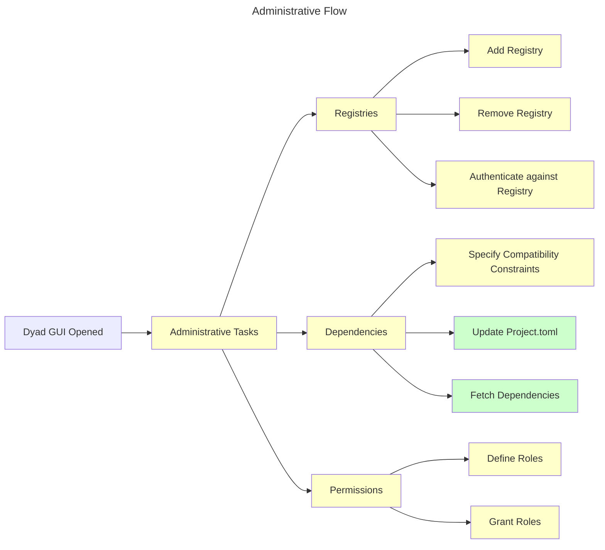

# Administrative Actions

```mermaid
---
title: Administrative Flow
---
flowchart LR
  classDef high fill:red,color:white;
  classDef med fill:orange;
  classDef low fill:#ffc;
  classDef done fill:#cfc;

  open[Dyad GUI Opened]
  admin[Administrative Tasks]
  reg[Registries]
  addreg[Add Registry]
  subreg[Remove Registry]
  authreg[Authenticate against Registry]
  deps[Dependencies]
  cons[Specify Compatibility Constraints]
  update[Update Project.toml]
  fetch[Fetch Dependencies]
  perms[Permissions]
  roles[Define Roles]
  grant[Grant Roles]

  class admin,roles,grant,perms,deps,cons,addreg,subreg,authreg,reg low
  class update,fetch done

  open --> admin
  admin --> reg
  admin --> deps
  admin --> perms
  reg --> addreg
  reg --> subreg
  reg --> authreg
  deps --> cons
  deps --> update
  deps --> fetch
  perms --> roles
  perms --> grant
```
