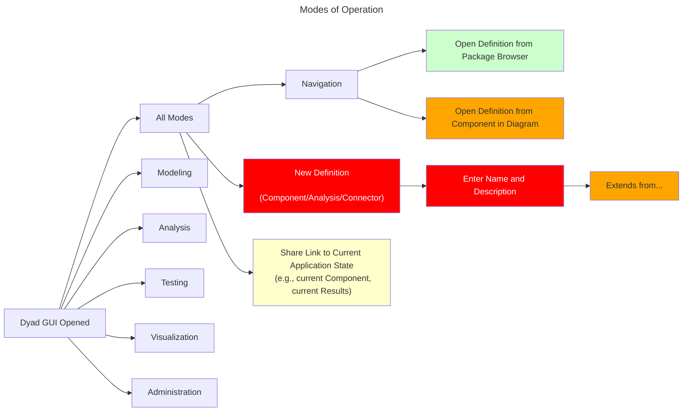

# GUI Open

At this point, the Dyad GUI application is open and ready for use.

## Workspace Assumptions

At this point it is important to understand that:

1. There is (at least) one project opened by the user.
2. The project itself is opened read/write (_i.e.,_ the user can edit it)
3. The project contains a `Project.toml` that lists the dependencies
4. Those dependencies should **also** be opened but in read-only mode (_i.e.,_ the user cannot edit those)

The user should see, somewhere in the left sidebar, the contents of the current
project **and** the contents of all dependencies _that contain Dyad definitions_ (pure Julia dependencies need not be shown in the side bar).

In the future, we may wish to have various ways of displaying and filtering the
contents of these libraries. To start with, a simple tree browser for each
library is sufficient.

## Modes of Operation

There are many tasks that the user can perform while the application is open.
In order to keep the descriptions orderly, we will organize these tasks
according to the kind of work the user is trying to accomplish. These will be
referred to as "modes of operation" but these do not necessarily need to be
reflected as different modes of operation in the GUI itself. For the purposes
of this document, these are just a convenient way of organizing the topics.

Before getting into the details of operations that are associated with specific
modes, let's first show the set of operations that are performed independent of
what mode of work the user is engaging in:

Now we can proceed with studying each mode in greater detail:

- [Modeling](./MODELING.md)
- [Analysis](./ANALYSIS.md)
- [Testing](./TESTING.md)
- [Visualization](./VISUALIZATION.md)
- [Administration](./ADMINISTRATION.md)
