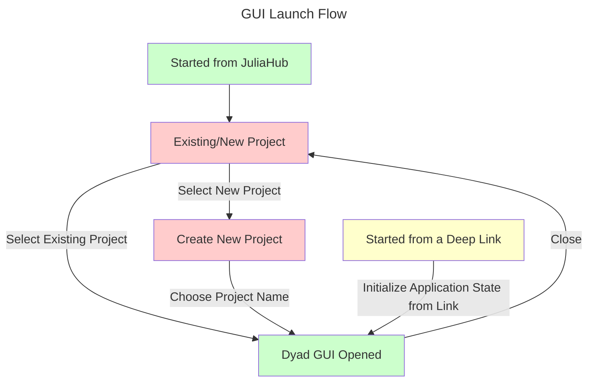

# Startup

This section covers how the application might be launched and the various paths
the user may take to the running Dyad GUI.

Once the application reaches the ["Dyad GUI Opened"](./OPENED.md) stage, the application is
running and there is a current project specified.
