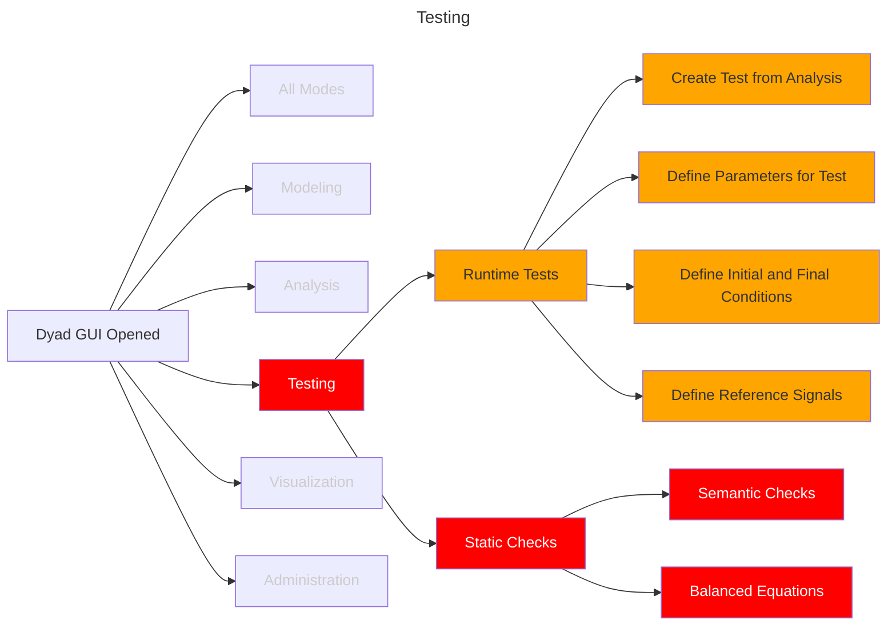

# Testing

The ability to create tests for verifying the correctness of models or detecting
regressions is an integral part of the model development process. These will be
refered to as "runtime tests". The point is that these tests require us to
perform an analysis and compare the results against some reference set of
results (or prescribed results). Another class of tests are onces that check the
validity of the models _prior_ to performing any computations. These will be
referred to as "static tests".

The tasks associated with this are laid out in this section. To orient
ourselves, let's view the various testing related tasks in the context of the
open application and the other models of operation:

