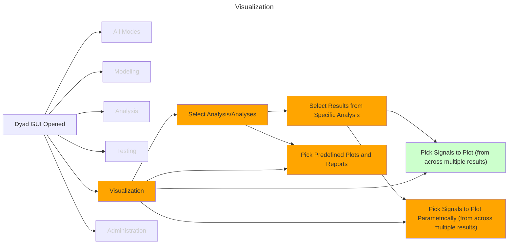

# Visualization

Once we have built our models, tested them and performed some analyses with
them, we'll ultimately want to visualize the results of these analyses. This
section describes the various interactions the user is likely to have with the
application in order to render those visualizations.

