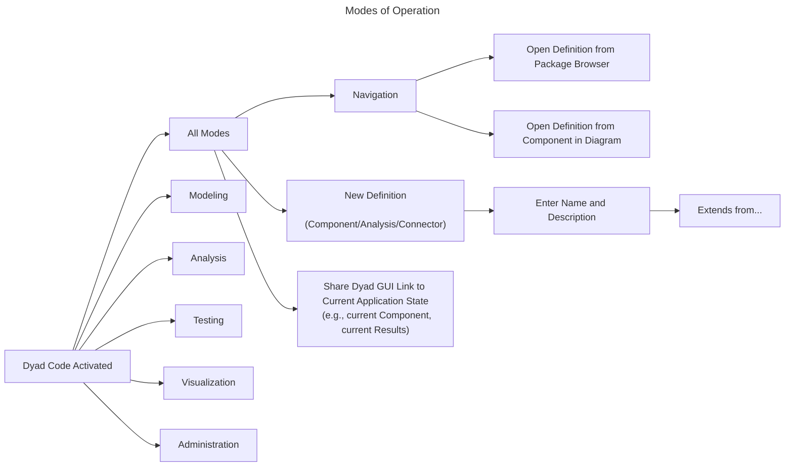

# Dyad Code Activated

At this point, the Dyad Code extension is activated and the underlying Dyad language server has started.

## Workspace Assumptions

At this point it is important to understand that:

1. There is (at least) one project opened by the user. A project is identified by a workspace folder that contains both a `Project.toml` file and a `dyad` directory.
2. The project itself is opened read/write (_i.e.,_ the user can edit it).
3. The project on the file system also is a `git` repository.
4. The project contains a `Project.toml` that lists the dependencies
5. Those dependencies should **also** be either:

- Workspace folders in VS Code
- Locatable on the file system by running `Base.find_package(...)`

Ideally the Dyad Code extension would show a "outline" of the Workspace on
the left side bar that showed both Julia packages as well as Dyad libraries,
their submodules and the module contents.

In the future, we may wish to have various ways of displaying and filtering the
contents of these libraries. To start with, a simple tree browser for each
library is sufficient.

## Modes of Operation

There are many tasks that the user can perform while Dyad Code is active. In
order to keep the descriptions orderly, we will organize these tasks according
to the kind of work the user is trying to accomplish. These will be referred to
as "modes of operation" but these do not necessarily need to be reflected as
different modes of operation in the GUI itself. For the purposes of this
document, these are just a convenient way of organizing the topics.

Before getting into the details of operations that are associated with specific
modes, let's first show the set of operations that are performed independent of
what mode of work the user is engaging in:

Now we can proceed with studying each mode in greater detail:

- [Modeling](./MODELING.md)
- [Analysis](./ANALYSIS.md)
- [Testing](./TESTING.md)
- [Visualization](./VISUALIZATION.md)
- [Administration](./ADMINISTRATION.md)
