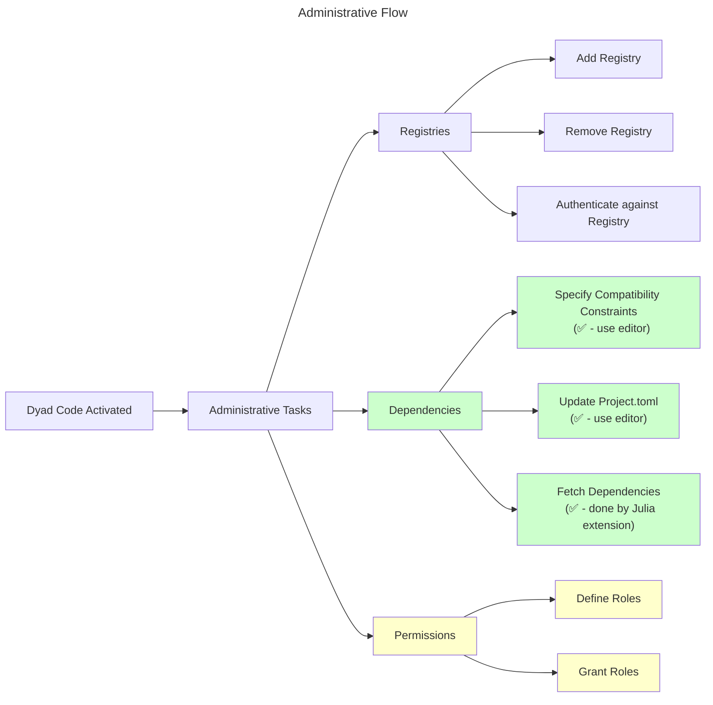

# Administrative Actions

```mermaid
---
title: Administrative Flow
---
flowchart LR
  open[Dyad Code Activated]
  admin[Administrative Tasks]
  reg[Registries]
  addreg[Add Registry]
  subreg[Remove Registry]
  authreg[Authenticate against Registry]
  deps[Dependencies]
  cons["Specify Compatibility Constraints
  (✅ - use editor)"]
  update["Update Project.toml
  (✅ - use editor)"]
  fetch["Fetch Dependencies
  (✅ - done by Julia extension)"]
  perms[Permissions]
  roles[Define Roles]
  grant[Grant Roles]

  style update fill:#ccffcc
  style fetch fill:#ccffcc
  style cons fill:#ccffcc
  style deps fill:#ccffcc

  style roles fill:#ffffcc
  style grant fill:#ffffcc
  style perms fill:#ffffcc

  open --> admin
  admin --> reg
  admin --> deps
  admin --> perms
  reg --> addreg
  reg --> subreg
  reg --> authreg
  deps --> cons
  deps --> update
  deps --> fetch
  perms --> roles
  perms --> grant
```
