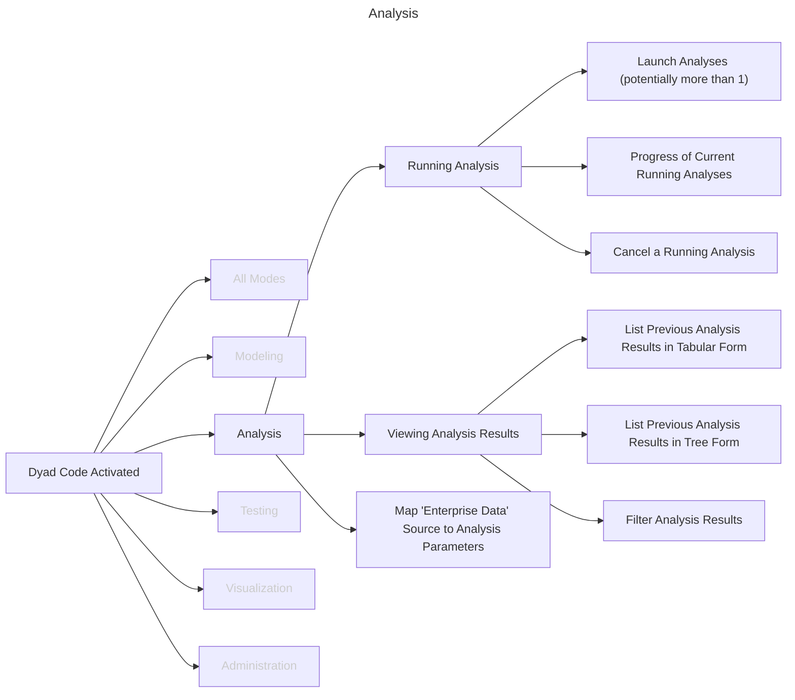

# Analysis

In addition to defining component models, Dyad also allows for the definition of
analyses. The creation of a new `analysis` is covered in the discussion of
[activites that occur across all modes](./OPENED.md#modes-of-operation).

To orient ourselves, let's view the various analysis related tasks in the
context of the open application and the other models of operation:

