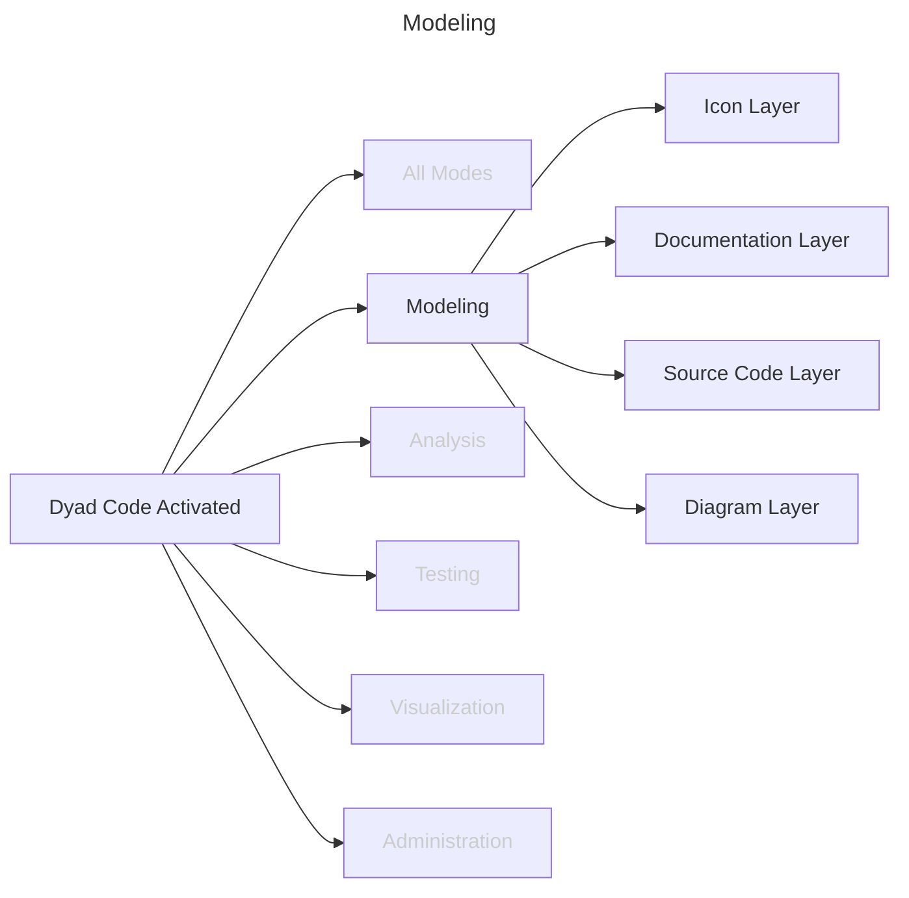
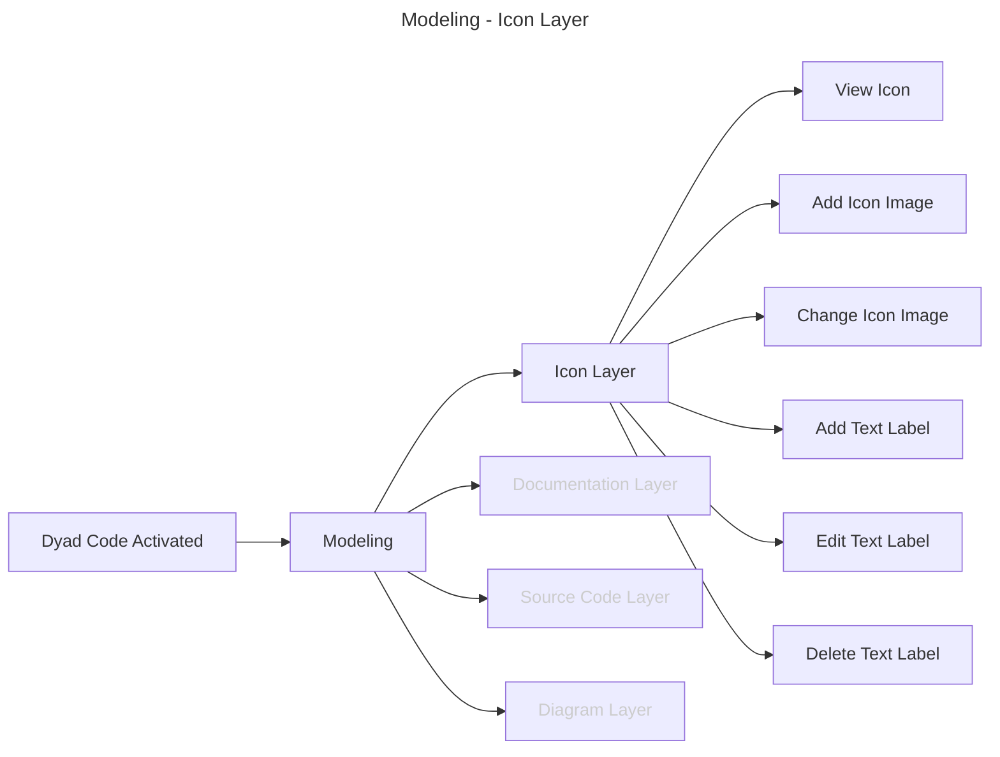
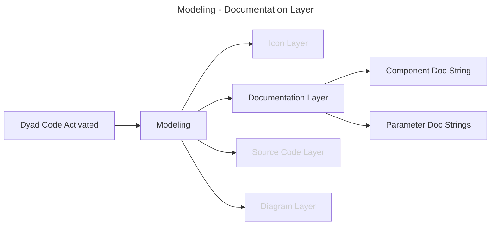
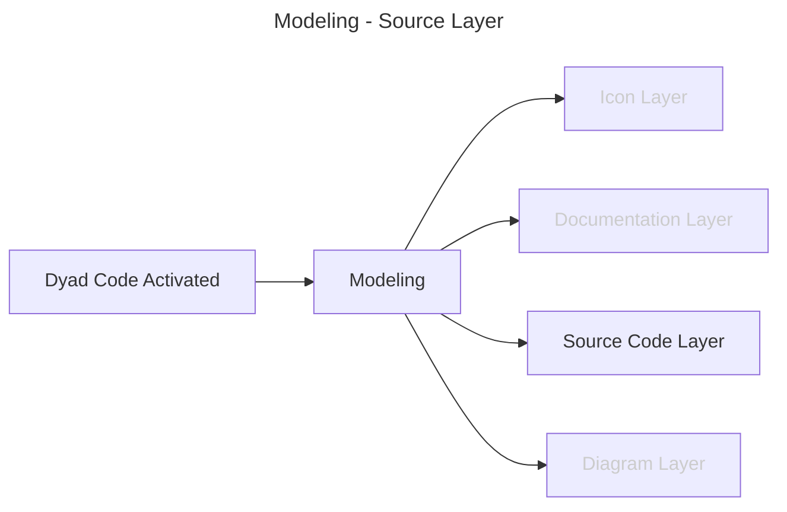
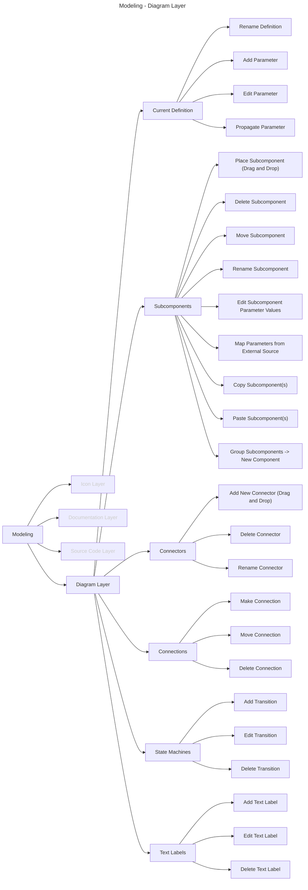

# Modeling

Because the primary purpose of Dyad Studio is to create and edit component
models, this section must also be subdivided into different sections. Recall
that there are different "layers" to a given Dyad component definition.
Specifically, these are conventionally the "icon", "diagram", "documentation"
and "text" layer. For this reason, we will divide the discussion of modeling
related tasks by layer (with an additional section for tasks that should be
possible in every layer).

The following is an overview and each subsequent section refines the view with
additional details:

## Icon Layer

The following figure shows tasks the user might perform that are related to the
icon associated with a given component

## Documentation Layer

A user may wish to view and/or edit the documentation associated with a Dyad
model. This figure lists the type of documentation the user should see and
could edit.

## Source Code Layer

When viewing the "raw" Dyad code, the user should have the possibility to edit
the code. This section doesn't enumerate the tasks because the user could do
literally anything to the code in this state. **However**, one thing to keep in
mind is that once the user is finished editing the code, the resulting text may
contain syntax errors. In terms of the Dyad AST, this would change the node
from a [`ParsedFile`](https://cautious-broccoli-8q238o4.pages.github.io/interfaces/ParsedFile.html) to a [`RawFile`](https://cautious-broccoli-8q238o4.pages.github.io/interfaces/RawFile.html) node.

## Diagram Layer

