# Startup

```mermaid
---
title: Dyad Studio Launch Flow
---
flowchart TB
  vscode[Visual Studio Code]
  install[Install Dyad Code Extension]
  create[Create New Project w/ ⌘P]
  prompt[Prompt for Project Name]
  dyad[Dyad Studio Active]
  vscode --> |Extension Not Installed?| install
  install --> vscode
  vscode --> |Existing Project?|dyad
  vscode --> |Empty Directory?|create
  create --> prompt
  prompt --> dyad
```

Once the application reaches the "Dyad Studio Active" stage, the Dyad
project should exist within VS Code, the Dyad Studio extension should be
activated and the Dyad language server should be running.
